# GCP의 VM에 도커 환경구성 및 튜토리얼

날짜: 2022년 4월 6일

**목차**

## 1. VM에 도커 환경구성

1. VM 인스턴스 만들기
2. 도커 설치
3. 설치 확인

## 2. 도커 튜토리얼

1. 이미지 빌드
2. 이미지 실행
3. DockerHub 가입 &  이미지 업로드

## 3. 도커 실전

1. MNIST 분류기 학습을 위한 도커 이미지 생성 및 컨테이너 실행
2. 과제

## 4. 참고하면 좋을 자료

---

# 0. 도커를 사용하는 이유

[https://www.google.com/search?q=도커를+사용하는+이유](https://www.google.com/search?q=도커를+사용하는+이유)

앞으로 배울 수많은 툴들은 필요한 기능을 구현하고자 하는 "도구"입니다. 이러한 관점이 중요하다고 어디선가 그러더라구요...!

# 1. VM에 도커 환경구성

GCP에서 제공하는 Virtual Machine에 도커 환경 구성합니다.

## 1.1 VM 인스턴스 만들기

1. [Google Cloud Console](https://console.cloud.google.com/)로 이동 후 결제정보 등록
2. Cloud Engine → VM 인스턴스 → API 사용설정
3. 인스턴스 만들기
   
    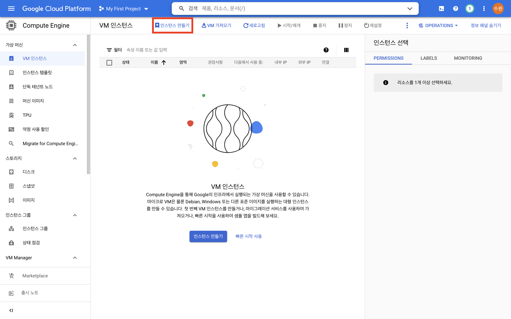
    
4. 방화벽 허용 후 VM 인스턴스 만들기
   
    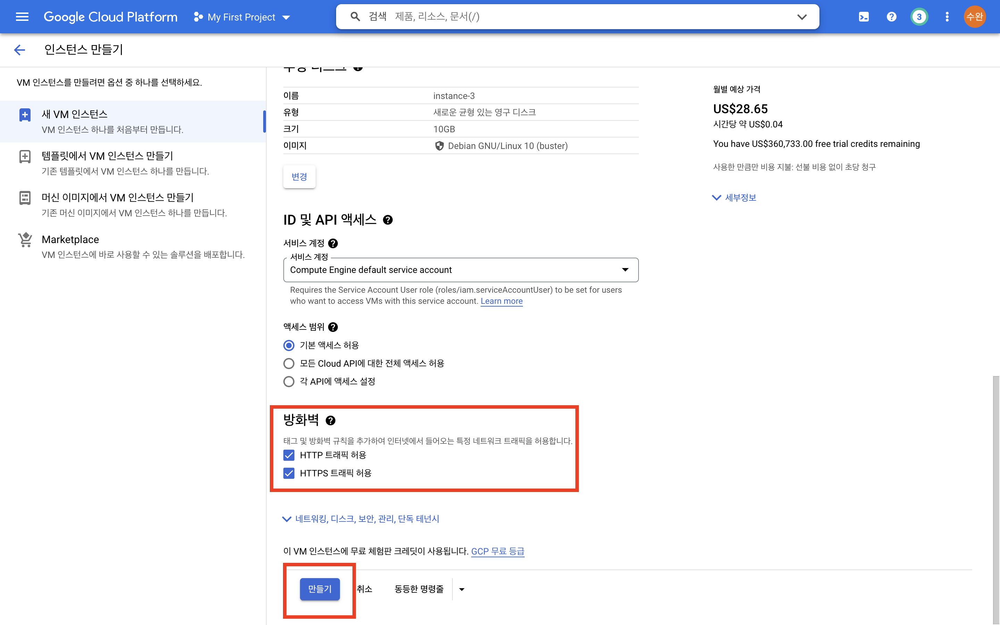
    
5. 생성된 인스턴스 확인
   
    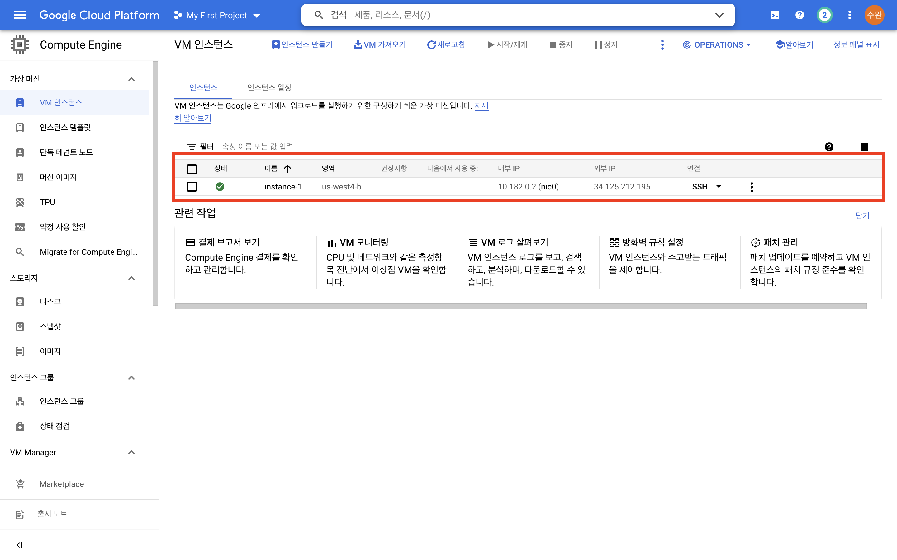
    
6. SSH 연결을 통해 인스턴스에 접근
   
    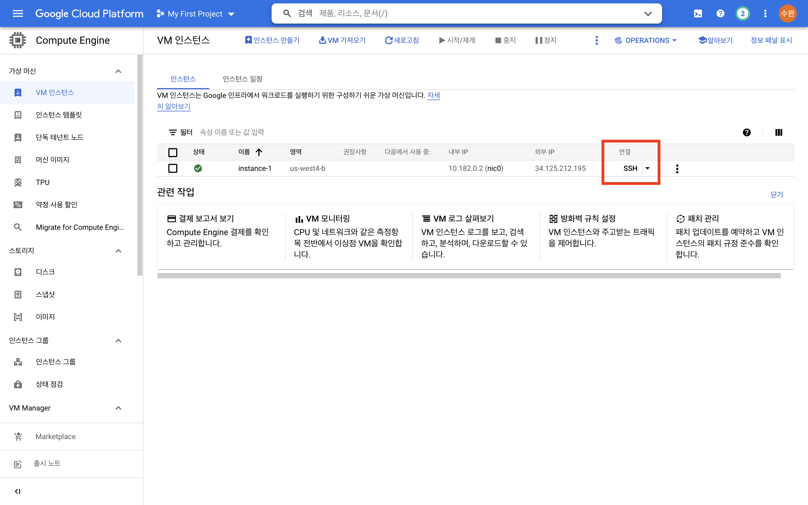
    
    SSH 연결 완료
    
    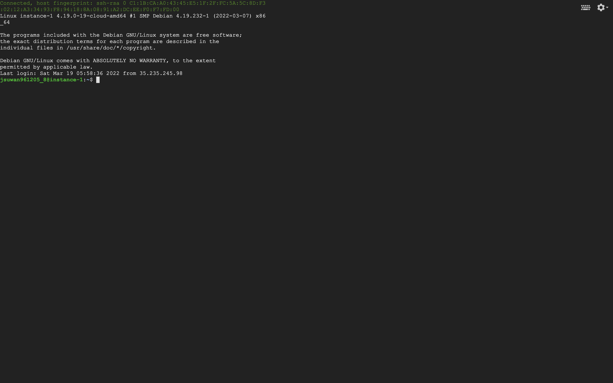
    

## 1.2 도커 설치

1. 도커 설치 (VM과 SSH로 연결한 콘솔에서 실행)
   
    ```bash
    sudo apt update
    
    sudo apt install --yes apt-transport-https ca-certificates curl gnupg2 software-properties-common
    
    curl -fsSL https://download.docker.com/linux/debian/gpg | sudo apt-key add -
    
    sudo add-apt-repository "deb [arch=amd64] https://download.docker.com/linux/debian $(lsb_release -cs) stable"
    
    sudo apt update
    
    sudo apt install --yes docker-ce
    ```
    
    사용자를 도커 그룹에 추가(sudo 명령어 없이 도커를 사용하기 위함)
    
    ```bash
    sudo usermod -aG docker $USER
    logout
    ```
    

## 1.3 설치 확인

1. 다시 SSH로 콘솔에 접속
   
    튜토리얼 컨테이너 실행
    
    ```bash
    docker run -d -p 80:80 docker/getting-started
    ```
    
2. 외부 IP 확인
   
    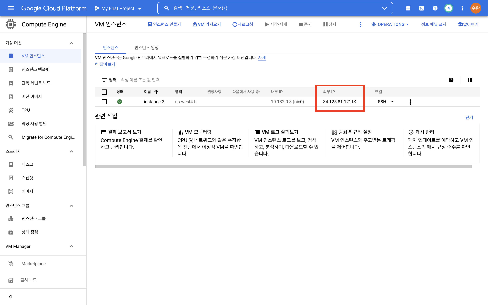
    
3. 실행확인 (인스턴스의 외부 IP로 접속)
   
    [http://34.125.81.121/](http://34.125.81.121/)
    
    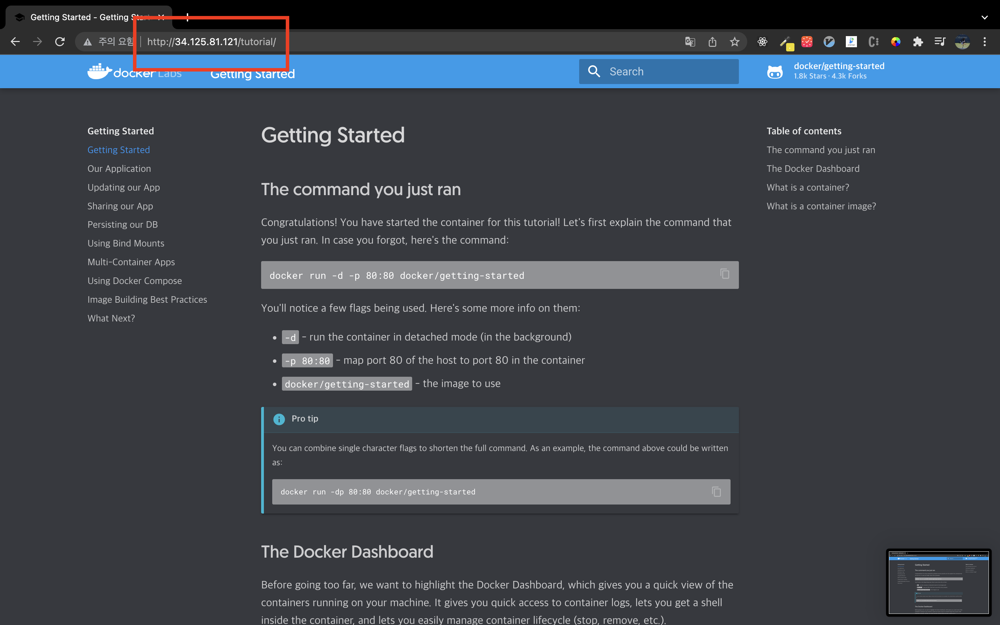
    

---

# 2. 도커 튜토리얼

도커로 컨테이너 이미지를 생성하기 위해선 `build` 라는 명령어와 함께 `Dockerfile` 이라는 스크립트 파일이 필요합니다. 필수 개념에 대해 배우고 MNIST 분류기 학습을 위한 이미지를 만들고 실행해봅니다. 그리고 어떻게 활용할 수 있을지 상상해봅니다.

## 2.1 이미지 빌드

아래의 과정은 도커를 설치한 환경에서 실행해야 하므로 도커를 설치한 VM에 SSH로 연결하여 실행합니다.

1. 작업 폴더 생성
   
    ```bash
    mkdir echo_hello
    
    ls # 폴더 생성 확인
    
    cd echo_hello # 작업 환경 변경
    ```
    
2. Dockerfile 파일 생성 (파일이름이 dockerfile 혹은 Dockerfile)
   
    ```bash
    nano Dockerfile # nano 편집기로 Dockerfile이라는 파일에 내용을 작성
    ```
    
    편집기에 아래의 내용 붙여넣기
    
    ```docker
    # 이미지의 베이스 이미지를 지정합니다.
    FROM ubuntu:latest 
    
    # 쉘에 hello를 출력합니다.
    CMD ["echo", "hello"] 
    ```
    
    control + x,  y, enter 로 편집기의 내용을 저장하고 빠져나옵니다. 
    
3. 이미지 빌드
   
    ```bash
    docker build -t <username>/echo-hello . # 닉네임을 적어주세요!
    ```
    
    아래와 같은 결과가 나오면 성공한겁니다!! 이미지 빌드 과정에서 Dockerfile의 명령어가 순차적으로 입력된 걸 확인할 수 있습니다.
    
    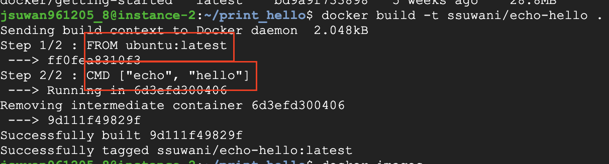
    
4. 생성된 이미지 확인
   
    ```bash
    docker images
    ```
    
    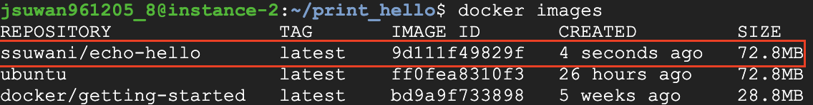
    

## 2.2 이미지 실행

2.1에서 생성한 hello를 출력하는 이미지를 Docker를 사용해서 실행합니다.

1. 이미지 실행
   
    ```bash
    docker run <username>/echo-hello
    ```
    
    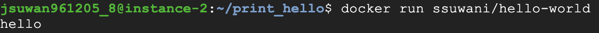
    

## 2.3 DockerHub 가입 & 이미지 업로드

지금까지 진행 한 뒤 여러분들의 컴퓨터에서 제 닉네임으로 만들어진 도커 이미지를 실행하면 실행이 될까요? 당연히 안되죠! 여러분들의 VM 환경과 제 VM 환경은 다르니까요.

하지만 이걸 가능하게 하는 방법이 도커 이미지 저장소(Dockerhub)에 업로드 하는 것입니다.

사실 이미지를 저장할 수 있는 저장소는 다양하게 있습니다. 마치 Github, bitbucket, Gitlab 등 Git 저장소 서비스가 있듯이요.

- Dockerhub
- Amazon Elastic Container Registry
- Github Container Registry
- Google Container Registry

1. Dockerhub 가입
   
    [https://hub.docker.com/](https://hub.docker.com/)
    
    Username, Email 정보를 기입하면 계정을 만들 수 있습니다. Username은 앞서 Docker 이미지를 생성할 때 사용했던 username과 동일하게 해주세요.
    
    만약 이미 있는 username이라 만들어지지 않는다면 2.1.3의 docker build 부터 다시 실행해주세요! 
    
    저는 이전에 다양한 이미지들이 업로드 되어 있어 아래와 같은 화면으로 보이네요.
    
    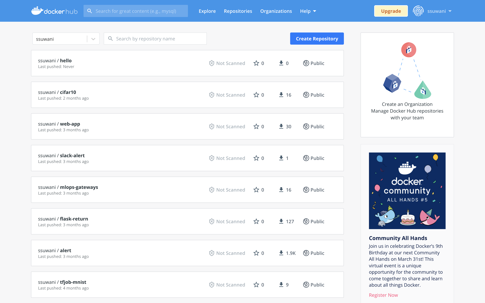
    
2. 이미지 업로드
   
    앞서 만든 hello를 출력하는 이미지를 Dockerhub에 업로드하여 누구나 볼 수 있게 해봅시다!
    
    ```bash
    docker push ssuwani/echo-hello
    ```
    
    결과는 아래와 같이 에러가 나오는 게 정상입니다. `docker push` 명령어는 DockerHub에 업로드 하는 것인데 아무나 제 계정에 업로드하면 안되겠죠? 
    
    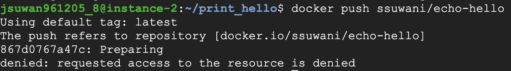
    
    **도커 허브에 로그인** 
    
    ```bash
    docker login
    ```
    
    Username과 Password를 입력해 아래와 같이 나오면 성공입니다!
    
    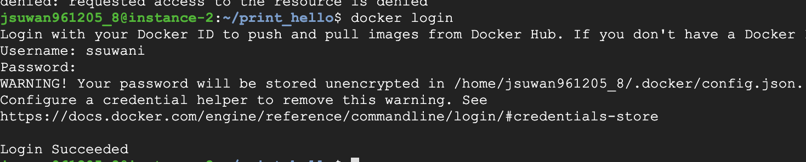
    
    **다시 한번 이미지 업로드!!**
    
    ```bash
    docker push ssuwani/echo-hello
    ```
    
    아래와 같이 콘솔이 나왔습니다.
    
    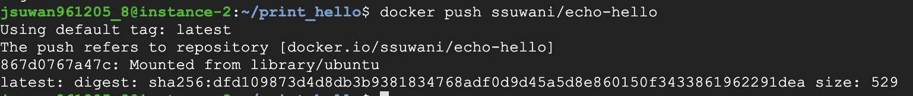
    
    DockerHub에서도 아래와 같이 echo-hello가 업로드 된 걸 확인할 수 있습니다!! 
    
    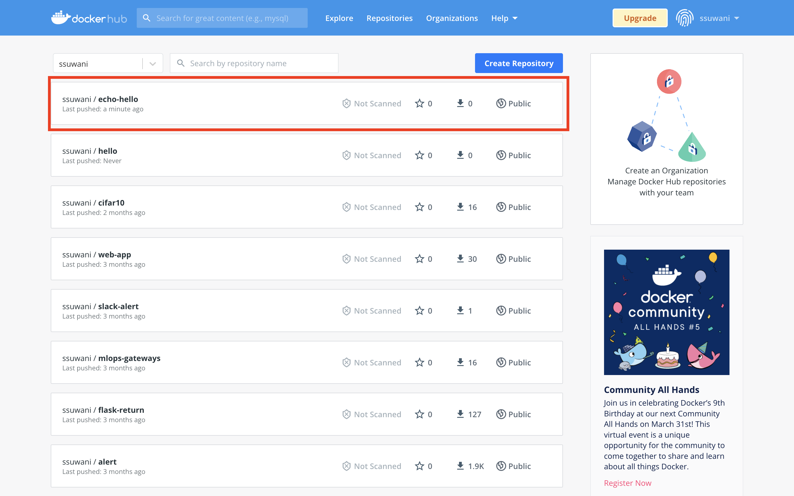
    

# 3. 도커 실전

## 3.1 MNIST 분류기 학습을 위한 도커 이미지 생성 및 컨테이너 실행

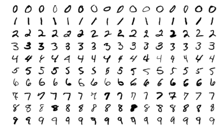

MNIST는 손글씨 데이터입니다. 분류기 모델을 학습하는 도커 이미지를 생성합니다.

`[train.py](http://train.py)` 파일을 작성하고 컨테이너 이미지에 추가한 뒤 컨테이너 내부에서 `train.py` 파일을 실행합니다.

```bash
mnist_train/
├── Dockerfile
└── train.py
```

1. 작업 환경 구성
   
    ```bash
    cd # 루트 디렉토리로 변경
    
    mkdir mnist_train
    
    cd mnist_train
    ```
    
2. Dockerfile 작성
   
    Base Image로 python3.8을 선택하고 필요한 라이브러리를 추가로 설치합니다.
    
    ```docker
    # Base Image를 python3.8로 설정
    FROM python:3.8
    
    # 필요한 라이브러리인 tensorflow 설치
    RUN pip install tensorflow
    
    # 정의한 train.py를 도커 컨테이너 내 루트 디렉토리에 추가
    ADD train.py /
    
    # "python /train.py" 명령어 실행
    CMD ["python", "/train.py"]
    ```
    
3. [train.py](http://train.py) 파일 작성
   
    tensorflow를 사용해 데이터를 불러오고 모델을 정의하고 학습합니다.
    
    ```python
    import tensorflow as tf
    
    mnist = tf.keras.datasets.mnist
    
    (x_train, y_train), (x_test, y_test) = mnist.load_data()
    x_train, x_test = x_train / 255.0, x_test / 255.0
    
    model = tf.keras.models.Sequential([
      tf.keras.layers.Flatten(input_shape=(28, 28)),
      tf.keras.layers.Dense(128, activation='relu'),
      tf.keras.layers.Dropout(0.2),
      tf.keras.layers.Dense(10, activation='softmax')
    ])
    
    model.compile(optimizer='adam',
                  loss='sparse_categorical_crossentropy',
                  metrics=['accuracy'])
    
    model.fit(x_train, y_train, epochs=5)
    
    model.evaluate(x_test,  y_test, verbose=2)
    ```
    
4. 이미지 빌드
   
    ```docker
    docker build -t <username>/mnist_train .
    ```
    
5. 이미지 실행
   
    ```docker
    docker run <username>/mnist_train
    ```
    
    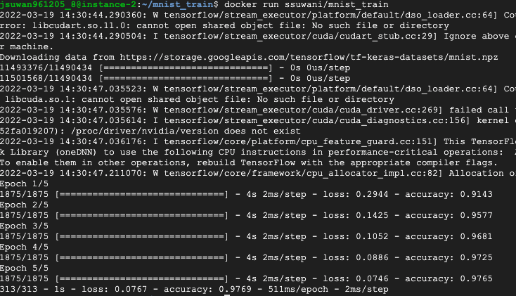
    

## 3.2 숙제

argparser를 통해 첫번째 Dense layer의 hidden_units 수를 입력받아 학습하는 컨테이너를 생성하고 실행하기

파일 구성은 앞선 3.1과 같이 아래와 같음

```bash
mnist_train/
├── Dockerfile
└── train.py
```

Dockerfile의 CMD에서 아래와 같이 실행시킬 것

```docker
CMD ["python", "/train.py", "--hidden_units", "512"]
```

제출 해야 할 파일

- Docker Hub에 이미지 업로드 한 뒤 캡처
- 이미지를 실행시킨 후 캡처


# 4. 참고하면 좋을 자료

- [초보를 위한 도커 안내서](https://subicura.com/2017/01/19/docker-guide-for-beginners-1.html) 
- [도커 입문편](https://www.44bits.io/ko/post/easy-deploy-with-docker)
