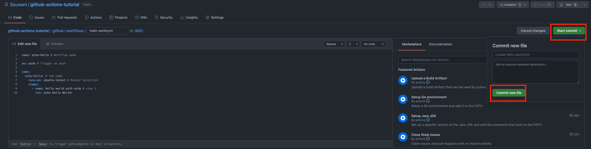
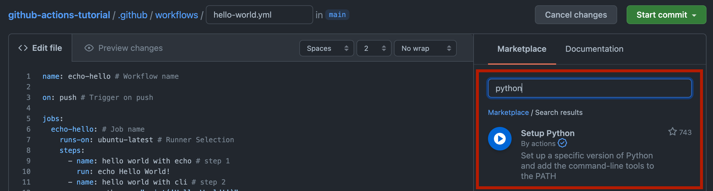

# Github Actions를 이용한 CI / CD

날짜: 2022년 4월 13일

목차

**0. 기본 개념**

**1. 새로운 레포지토리 만들기**

**2. Github Actions로 HelloWorld 출력하기**

1. Bash
2. Python
3. Python File

**3. CI : Continuous Integration**

1. Dockerizing
2. Secrets

**4.** 모델 저장 및 GCS 업로드

**5. 숙제: GCS에 업로드 된 모델 캡처하기**

## 0. 기본 개념

[https://zzsza.github.io/development/2020/06/06/github-action/](https://zzsza.github.io/development/2020/06/06/github-action/) 

**Github Actions**

- Workflow
- Event
- Job
- Step
- Action
- Runner (workflow가 실행되는 인스턴스)


## 1. 새로운 레포지토리 만들기

[https://github.com/new](https://github.com/new) 로 이동

**Repository name**

- **github-actions-tutorial**


레포지토리에서 Actions 탭을 클릭합니다.


Actions에서 Workflow를 위한 다양한 템플릿을 제공해줍니다.

우리는 **set up a workflow yourself**를 클릭해 기본 템플릿으로 시작합니다.


레포지토리에 내 `.github/workflows` 폴더 아래에 `main.yml` 파일이 생성됨

`main.yml` 이라는 이름은 변경 가능하나 `.github/workflows` 는 변경 불가능


## 2. Github Actions로 HelloWorld 출력하기

모두 동일한 결과를 얻고자 합니다. 

1. Bash
2. Python
3. Python File

결과: “Hello World!” 라는 문자열을 출력하기

### 2-1. Bash

main.yml → hello-world.yml

```yaml
name: echo-hello # Workflow name

on: push # Trigger on push

jobs:
  echo-hello: # Job name
    runs-on: ubuntu-latest # Runner Selection 
    steps:
      - name: hello world with echo # step 1
        run: echo Hello World!
```

위의 코드 입력 후 `Start commit` → `Commit new file`



그러면 하나의 파일이 생성되었다. (push가 발생했다) 

때문에 `on: push` 로 인해 Workflow가 Trigger 되었음을 예상할 수 있다. 확인해보자! 


실행된 Workflow들 보기


Workflow 실행 로그 보기(jobs)


Job 실행 로그 보기 (steps)


Step 실행 로그 보기


### 2-2. Python

기존의 hello-world.yml 파일을 수정합니다. 

레포지토리를 복제해서 수정 후 Push 할 수도 있지만 간단히 GIthub 내에서 수정해보겠습니다.


Step 2 정의

```yaml
name: echo-hello # Workflow name

on: push # Trigger on push

jobs:
  echo-hello: # Job name
    runs-on: ubuntu-latest # Runner Selection 
    steps:
      - name: hello world with echo # step 1
        run: echo Hello World!

      - name: hello world with cli # step 2
        run: python -c "print('Hello World!')"
```

추가 & Push & 결과 확인


Step 3 정의 - 파이썬 버전 확인

```yaml
name: echo-hello # Workflow name

on: push # Trigger on push

jobs:
  echo-hello: # Job name
    runs-on: ubuntu-latest # Runner Selection 
    steps:
      - name: hello world with echo # step 1
        run: echo Hello World!

      - name: hello world with cli # step 2
        run: python -c "print('Hello World!')"

      - name: python version check
        run: python --version
```


ubuntu-latest 환경에 python 버전 3.8.10이 default로 설치되어 있는 것을 확인할 수 있다.

내가 원하는 파이썬 버전으로 설정하고 싶다면?? 설치하면 된다.

```yaml
name: echo-hello

on: push 

jobs:
  echo-hello: 
    runs-on: ubuntu-latest 
    steps:
      - name: hello world with echo 
        run: echo Hello World!

      - name: hello world with cli
        run: python -c "print('Hello World!')"

      - name: python version check
        run: python --version

      - name: python version upgrade (3.9)
        run: sudo apt install python3.9

      - name: python version check
        run: python3.9 --version
```

이러한 설치 과정은 번거롭다.. 누군가 만들어 놓은 packages를 사용해 간단히 해보자.

> *바퀴를 다시 발명하지 마라.*
> 

Marketplace에서 python 검색



```yaml
name: echo-hello

on: push

jobs:
  echo-hello:
    runs-on: ubuntu-latest
    steps:
      - name: Set Python Version to 3.9
        uses: actions/setup-python@v3.1.1
        with:
          python-version: "3.9"

      - name: python version check 
        run: python --version
```

실행확인


### 2-3. Python File

지금까지의 환경은 ubuntu-latest라는 Github에서 제공하는 환경에서 실행된 것이다.

ls와 pwd를 통해 폴더 구성을 옅보자.

```yaml
name: echo-hello

on: push

jobs:
  echo-hello:
    runs-on: ubuntu-latest
    steps:
      - name: Set Python Version to 3.9
        uses: actions/setup-python@v3.1.1
        with:
          python-version: "3.9"

      - name: python version check 
        run: python --version
      
      - name: Run ls
        run: ls -al # 숨김 파일 및 폴더를 포함해 자세히 본다.
        
      - name: Run pwd
        run: pwd # print working directory
```


### 2-3-1 Clone

위의 결과를 보면 현재 작업폴더에는 텅 비어있다는 걸 볼 수 있다. 

python file을 실행하기 위해선 현재 레포지토리를 복제해야한다.

`git clone https://github.com/Ssuwani/github-actions-tutorial`

```yaml
name: echo-hello

on: push

jobs:
  echo-hello:
    runs-on: ubuntu-latest
    steps:
      - name: Set Python Version to 3.9
        uses: actions/setup-python@v3.1.1
        with:
          python-version: "3.9"

      - name: python version check 
        run: python --version
        
      - name: Clone My Repo
        run: git clone https://github.com/Ssuwani/github-actions-tutorial
      
      - name: Run ls
        run: ls -al
        
      - name: Run pwd
        run: pwd
```


### 2-3-2 Checkout

사실 위의 Clone 방식보단 Checkout 방식이 표준

브랜치간의 이동

Marketplace에서 checkout 검색


```yaml
name: echo-hello

on: push

jobs:
  echo-hello:
    runs-on: ubuntu-latest
    steps:
      - name: Set Python Version to 3.9
        uses: actions/setup-python@v3.1.1
        with:
          python-version: "3.9"

      - name: python version check 
        run: python --version
        
      - name: Checkout
        uses: actions/checkout@v3.0.0
      
      - name: Run ls
        run: ls -al
        
      - name: Run pwd
        run: pwd
```

실행확인


### 2-3-3 Python File 생성

앞서와 마찬가지로 레포지토리를 복제하고 파일을 생성한 뒤 추가할 수 있지만 깃허브 내에서 해보겠다.


파일 생성


파일 추가


### 2-3-4 Python File 실행

기존과 마찬가지로 `hello-world.yml` 파일을 수정한다.

```yaml
name: echo-hello

on: push

jobs:
  echo-hello:
    runs-on: ubuntu-latest
    steps:
      - name: Set Python Version to 3.9
        uses: actions/setup-python@v3.1.1
        with:
          python-version: "3.9"

      - name: python version check 
        run: python --version
        
      - name: Checkout
        uses: actions/checkout@v3.0.0
      
      - name: Run ls
        run: ls -al
        
      - name: Run pwd
        run: pwd
        
      - name: Run Python File
        run: python hello.py # hello.py 실행
```


## 3. Continuous Integration

**CI**는 테스트, 빌드, Dockerizing, 저장소에 전달 까지 프로덕션 환경으로 서비스를 배포할 수 있도록 준비하는 프로세스

**CD**는 저장소로 전달된 프로덕션 서비스를 실제 사용자들에게 배포하는 프로세스를 의미한다.

출처. [https://hwasurr.io/git-github/github-actions/](https://hwasurr.io/git-github/github-actions/)

**CI / CD를 위한 툴들**

- Jenkins
- CircleCI
- Travis CI
- Cloud Build(GCP)
- Code Deploy(AWS)
- Github Actions

**Github Actions**

Github에서 제공하는 CI/CD 도구

### 3-1 Dockerizing

***도커라이징이란*** 해당 애플리케이션을 도커 컨테이너에서 실행할 수 있도록 하는 과정

출처: [https://seohyun0120.tistory.com/entry/Nodejs-웹-앱의-도커라이징](https://seohyun0120.tistory.com/entry/Nodejs-%EC%9B%B9-%EC%95%B1%EC%9D%98-%EB%8F%84%EC%BB%A4%EB%9D%BC%EC%9D%B4%EC%A7%95)

Prerequirement: `dockerfile`

Docker build → Docker push

1. 작업 환경 구성
   
    ```bash
    mnist_train/
    ├── Dockerfile
    └── train.py
    ```
    
2. Dockerfile 작성
   
    ```docker
    FROM python:3.8
    
    RUN pip install tensorflow
    
    ADD train.py /
    
    CMD [ "python", "train.py", "--units", "512" ]
    ```
    
3. [train.py](http://train.py) 작성
   
    ```python
    import tensorflow as tf
    import argparse
    
    parser = argparse.ArgumentParser()
    parser.add_argument(
        "--units",
        type=int,
        default=512,
        help="number of first dense layer hidden units"
    )
    args = parser.parse_args()
    units = int(args.units)
    print(f"\n---first dense layer hidden unit: {units}---\n")
    mnist = tf.keras.datasets.mnist
    
    (x_train, y_train), (x_test, y_test) = mnist.load_data()
    x_train, x_test = x_train / 255.0, x_test / 255.0
    
    model = tf.keras.models.Sequential([
      tf.keras.layers.Flatten(input_shape=(28, 28)),
      tf.keras.layers.Dense(units, activation='relu'),
      tf.keras.layers.Dropout(0.2),
      tf.keras.layers.Dense(10, activation='softmax')
    ])
    
    model.compile(optimizer='adam',
                  loss='sparse_categorical_crossentropy',
                  metrics=['accuracy'])
    
    model.fit(x_train, y_train, epochs=5)
    
    model.evaluate(x_test,  y_test, verbose=2)
    ```
    
4. 이미지 빌드 → **이 과정을 자동화**
   
    ```bash
    docker build -t ssuwani/mtrain .
    ```
    
5. 이미지 업로드 → **이 과정을 자동화**
   
    ```bash
    docker push ssuwani/mtrain
    ```
    

4, 5번의 내용을 Github Actions를 통해 자동화 하고자 한다.

Docker 환경 구성

Marketplace에 docker 검색

판단, 나에게 필요한 것 + Star 수 


```yaml
name: dockerize-on-mtrain

on: 
  push:
    paths:
      - mtrain/**
jobs:
  dockerize:
    runs-on: ubuntu-latest
    steps:
      - name: Docker Login
        uses: docker/login-action@v1.14.1
        with:
          username: ssuwani
          password: <password>
      - name: Docker build
      - name: Docker push
```

### Secrets ‼️

Settings → Screts → Actions → New repository secret


Secrets 사용

```yaml
name: dockerize-on-mtrain

on:
  push:
    paths:
      - mnist_train/**
      - .github/workflows/dockerize.yml # yaml이 변경될 때도 workflow 실행되게
jobs:
  dockerize:
    runs-on: ubuntu-latest
    steps:
      - name: Docker Login
        uses: docker/login-action@v1.14.1
        with:
          username: ssuwani
          password: ${{ secrets.DOCKER_PASSWORD}} # secret 가져오기

      - name: Checkout
        uses: actions/checkout@v3.0.0

      - name: Docker build
        run: docker build -t ssuwani/mtrain mnist_train

      - name: Docker push
        run: docker push ssuwani/mtrain
```

## 4. 모델 저장 및 GCS 업로드

- 모델을 저장하는 코드
- GCS에 업로드 하는 코드
- 학습 시 모델이 저장되는 곳은? 컨테이너 내부
- → Volume Mount with host(Runner)
- GCS 버킷에 업로드

`train.py`

```python
import tensorflow as tf
import argparse

parser = argparse.ArgumentParser()
parser.add_argument(
    "--units",
    type=int,
    default=512,
    help="number of first dense layer hidden units"
)
args = parser.parse_args()
units = int(args.units)
print(f"\n---first dense layer hidden unit: {units}---\n")
mnist = tf.keras.datasets.mnist

(x_train, y_train), (x_test, y_test) = mnist.load_data()
x_train, x_test = x_train / 255.0, x_test / 255.0

model = tf.keras.models.Sequential([
  tf.keras.layers.Flatten(input_shape=(28, 28)),
  tf.keras.layers.Dense(units, activation='relu'),
  tf.keras.layers.Dropout(0.2),
  tf.keras.layers.Dense(10, activation='softmax')
])

model.compile(optimizer='adam',
              loss='sparse_categorical_crossentropy',
              metrics=['accuracy'])

model.fit(x_train, y_train, epochs=1)

model.evaluate(x_test,  y_test, verbose=2)

model.save('/models/saved_model')
```

`run-train.yml`

```yaml
name: run-mtrain

on:
  push:
    paths:
      - .github/workflows/run-train.yml
jobs:
  train:
    runs-on: ubuntu-latest
    env:
      BASE_DIR: "/var/lib/docker/volumes"
      TMP_FOLDER: "tmp"
    steps:
      - name: check docker
        run: docker

      - name: train with docker
        # host의 directory와 container의 directory를 연결
        run: docker run -v ${{env.TMP_FOLDER}}:/models ssuwani/mtrain

      - name: ls on tmp
        run: sudo ls ${{env.BASE_DIR}}/${{env.TMP_FOLDER}}/_data/saved_model
      
      # 권한 문제가 발생해서 복사해왔다.
      - name: copy saved model
        run: |
          sudo cp -r ${{env.BASE_DIR}}/${{env.TMP_FOLDER}}/_data/saved_model .

      - name: check files
        run: ls saved_model

      - name: Cloud Storage Uploader
        uses: google-github-actions/upload-cloud-storage@v0.9.0
        with:
          credentials: ${{ secrets.GCP_CREDENTIAL }}
          path: saved_model
          destination: test-20220413
```

## 숙제: GCS에 업로드 된 모델 캡처하기

## 참고자료

- [https://zzsza.github.io/development/2020/06/06/github-action/](https://zzsza.github.io/development/2020/06/06/github-action/)