# k8s

주차: 3

1. 쿠버네티스란
2. 쿠버네티스 클러스터 생성하기
3. 애플리케이션 배포하기
4. 파드와 노드 보기
5. 앱 외부로 노출하기
6. 애플리케이션 스케일링 하기
7. 앱 업데이트하기

# 1. 쿠버네티스란

쿠버네티스는 컨테이너화된 워크로드와 서비스를 관리하기 위한 이식성이 있고, 확장가능한 오픈소스 플랫폼이다. 쿠버네티스는 선언적 구성과 자동화를 모두 용이하게 해준다.


출처: [https://kubernetes.io/ko/docs/concepts/overview/what-is-kubernetes/](https://kubernetes.io/ko/docs/concepts/overview/what-is-kubernetes/)

추천자료: **[20분 만에 전공자처럼 도커, 가상화 이해하기!](https://www.youtube.com/watch?v=zh0OMXg2Kog)**

쿠버네티스를 사용하는 이유

- **서비스 디스커버리와 로드 밸런싱** 
쿠버네티스는 DNS 이름을 사용하거나 자체 IP 주소를 사용하여 컨테이너를 노출할 수 있다. 컨테이너에 대한 트래픽이 많으면, 쿠버네티스는 네트워크 트래픽을 로드밸런싱하고 배포하여 배포가 안정적으로 이루어질 수 있다.
- **스토리지 오케스트레이션** 
쿠버네티스를 사용하면 로컬 저장소, 공용 클라우드 공급자 등과 같이 원하는 저장소 시스템을 자동으로 탑재 할 수 있다.
- **자동화된 롤아웃과 롤백** 
쿠버네티스를 사용하여 배포된 컨테이너의 원하는 상태를 서술할 수 있으며 현재 상태를 원하는 상태로 설정한 속도에 따라 변경할 수 있다. 예를 들어 쿠버네티스를 자동화해서 배포용 새 컨테이너를 만들고, 기존 컨테이너를 제거하고, 모든 리소스를 새 컨테이너에 적용할 수 있다.
- **자동화된 빈 패킹(bin packing)** 
컨테이너화된 작업을 실행하는데 사용할 수 있는 쿠버네티스 클러스터 노드를 제공한다. 각 컨테이너가 필요로 하는 CPU와 메모리(RAM)를 쿠버네티스에게 지시한다. 쿠버네티스는 컨테이너를 노드에 맞추어서 리소스를 가장 잘 사용할 수 있도록 해준다.
- **자동화된 복구(self-healing)** 
쿠버네티스는 실패한 컨테이너를 다시 시작하고, 컨테이너를 교체하며, '사용자 정의 상태 검사'에 응답하지 않는 컨테이너를 죽이고, 서비스 준비가 끝날 때까지 그러한 과정을 클라이언트에 보여주지 않는다.
- **시크릿과 구성 관리** 
쿠버네티스를 사용하면 암호, OAuth 토큰 및 SSH 키와 같은 중요한 정보를 저장하고 관리 할 수 있다. 컨테이너 이미지를 재구성하지 않고 스택 구성에 시크릿을 노출하지 않고도 시크릿 및 애플리케이션 구성을 배포 및 업데이트 할 수 있다.

# 2. 쿠버네티스 클러스터 생성하기

## 2.1 GKE로 클러스터 만들기

1. [GCP 콘솔](https://console.cloud.google.com/)로 이동
2. Kubernetes Engine → 클러스터 → API 사용설정
3. 만들기 → GKE Standard → 만들기 (5분이내 소요)

**VM에서 생성된 노드 확인**

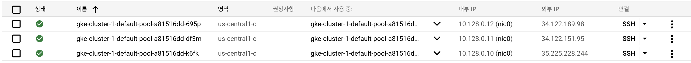

3개의 VM이 생성된 것을 확인할 수 있다.

## 2.2 GKE를 관리할 인스턴스 만들기

1. VM 인스턴스로 이동
2. 인스턴스 만들기
3. 액세스 범위 → 모든 Cloud API에 대한 전체 엑세스 허용
4. 방화벽 → HTTP, HTTPS 트래픽 허용
5. 만들기 (1분이내 소요)

## 2.3 VM과 GKE 연결하기

1.2에서 GKE를 관리할 VM을 생성했다. 이제 실제로 GKE에 연결해보자.

1. 클러스터 상세보기
   
    
    
1. 연결을 위한 안내 
   
    
    
2. 해당 명령어를 복사
   
    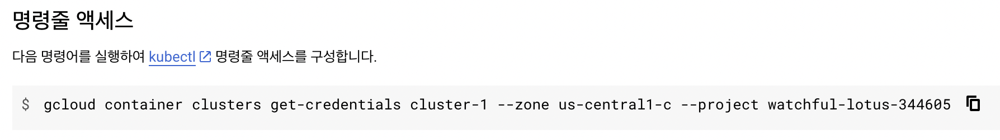
    
3. 1.2에서 생성한 VM에 입력 (VM 대시보드로 이동해서 해당 인스턴스 SSH 연결)
   
    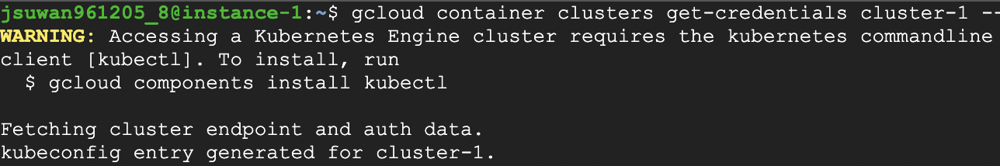
    
4. kubectl 설치 - 쿠버네티스 클러스터를 제어하기 위한 커맨드 라인 도구
   
    ```bash
    sudo apt-get install kubectl
    ```
    
5. 연결확인 - 클러스터에 연결된 확인
   
    ```bash
    kubectl get node
    # kubectl get node -o wide (상세정보)
    ```
    
    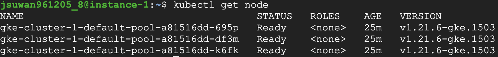
    

# 3. 애플리케이션 배포하기

ssuwani/fastapi의 파일 구성

```bash
app
├── dockerfile
└── main.py
```

`dockerfile`

```docker
FROM python:3.8
RUN pip install "fastapi[all]"
COPY . /app
WORKDIR /app
CMD ["python", "main.py"]
```

`main.py`

```python
from fastapi import FastAPI
import uvicorn

app = FastAPI()

@app.get("/")
async def root():
    return f"안녕하세요. 😘"

if __name__ == "__main__":
    uvicorn.run(app="main:app", host='0.0.0.0', port=8080)
```

도커 이미지 만들고 푸쉬

[여기](https://github.com/Ssuwani/mlops-tutorial/tree/main/1-gcp-docker-tutorial#12-%EB%8F%84%EC%BB%A4-%EC%84%A4%EC%B9%98)를 참고해 주세요

```python
docker build -t ssuwani/fastapi .
docker push ssuwani/fastapi
```

1. 배포
   
    ```bash
    kubectl create deployment --image=ssuwani/fastapi fastapi
    ```
    
2. 조회
   
    ```bash
    kubectl get pods
    ```
    

단축 명렁어: `alias k=kubectl` → 앞으로의 명령어는 k로 대체

1. pod의 상세 정보 보기
   
    ```bash
    k get pods -o wide
    ```
    
    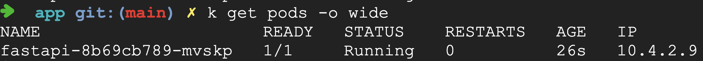
    
1. pod의 IP의 8080 포트의 `/` 라우터 확인
   
    ```bash
    curl 10.4.2.9:8080
    ```
    
    
    
    이는 외부에서 접속할 수 있는 외부 IP가 아니고 Pod에 할당된 IP에 접속하는 것이다.
    
1. Deployments의 Scale 조정하기
   
    ```python
    k scale deployments/fastapi --replicas=2
    ```
    
    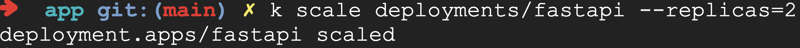
    
1. 스케일 조정 결과 확인
   
    ```python
    k get pods -o wide
    ```
    
    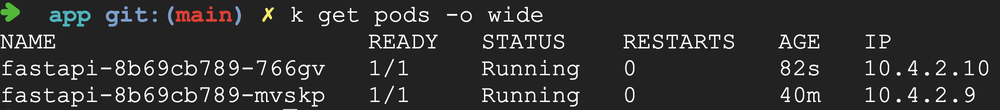
    
    동일한 결과를 내는 두개의 Pod
    
    `curl 10.4.2.10:8080`  → 안녕하세요. **😘**
    
    `curl 10.4.2.9:8080` → 안녕하세요. **😘**
    

# 4. 파드와 노드 보기

[https://kubernetes.io/ko/docs/tutorials/kubernetes-basics/explore/explore-intro/](https://kubernetes.io/ko/docs/tutorials/kubernetes-basics/explore/explore-intro/)

## 4.1 Pod

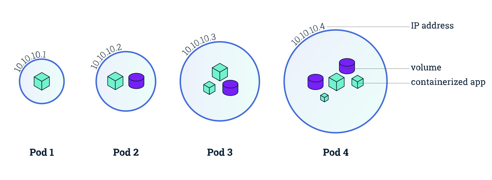

- 파드는 쿠버네티스 플랫폼 상에서 최소 단위

```bash
k get pods
```

## 4.2 Node

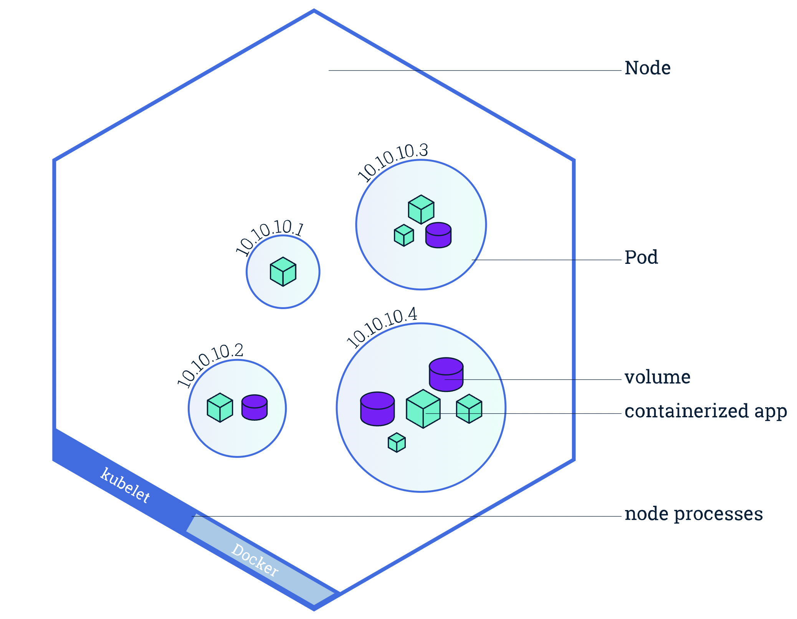

- 노드는 쿠버네티스에서 워커 머신
- 하나의 노드는 여러 개의 파드를 가질 수 있다.

```bash
k get node
```

# 5. 앱 외부로 노출하기

[https://kubernetes.io/ko/docs/tutorials/kubernetes-basics/expose/expose-intro/](https://kubernetes.io/ko/docs/tutorials/kubernetes-basics/expose/expose-intro/)

서비스: 파드들을 외부 트래픽에 노출하기


Service를 위한 3가지 타입에 대한 설명

[https://blog.leocat.kr/notes/2019/08/22/translation-kubernetes-nodeport-vs-loadbalancer-vs-ingress](https://blog.leocat.kr/notes/2019/08/22/translation-kubernetes-nodeport-vs-loadbalancer-vs-ingress)

1. Cluster IP
2. NodePort
3. LoadBalancer

1. LoadBalancer 타입으로 서비스 생성
   
    ```python
    k expose deployments/fastapi --port=8080 --type=LoadBalancer
    ```
    
2. 생성된 Service 확인
   
    
    
    <pending>은 아직 할당되지 않았음을 의미
    
    External IP가 할당되기까지 30초 이상 소요된다.
    
1. 추가로 alias 설정 (선택)
   
    **`alias wk='watch kubectl'`**
    
    ```python
    wk get svc # watch kubectl get svc, 2초마다 kubectl get svc 명령어 실행
    ```
    
    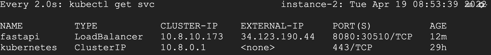
    
1. 서비스를 통해 Pod에 접근
   
    `curl 34.123.190.44:8080`
    
    
    

# 6. 애플리케이션 스케일링 하기

쿠버네티스: 컨테이너화된 애플리케이션의 자동 디플로이, **스케일링**을 제공하는 관리시스템

갑자기 트래픽이 증가하면 어쩌지?? Auto Scaler

→ 트래픽에 따라 적절한 만큼의 배포를 할 수 있게 해준다.

- Horizontal Pod AutoScaler → 실행되는 Pod의 수를 늘린다.
- Vertical Pod AutoScaler → Pod에 할당되는 리소스를 늘린다.
- Cloud AutoScaler → 실행되는 노드의 수를 늘린다.

Deployments →

[https://kubernetes.io/ko/docs/concepts/workloads/controllers/deployment/](https://kubernetes.io/ko/docs/concepts/workloads/controllers/deployment/)

HPA →

[https://kubernetes.io/ko/docs/tasks/run-application/horizontal-pod-autoscale-walkthrough/](https://kubernetes.io/ko/docs/tasks/run-application/horizontal-pod-autoscale-walkthrough/)

1. Deployment와 Service 정의
   
    `fastapi-busy.yaml`
    
    ```yaml
    apiVersion: apps/v1
    kind: Deployment
    metadata:
      name: fastapi-deployment
      labels:
        app: fastapi
    spec:
      replicas: 1
      selector:
        matchLabels:
          app: fastapi
      template:
        metadata:
          labels:
            app: fastapi
        spec:
          containers:
          - name: fastapi
            image: ssuwani/fastapi-busy:latest
            ports:
            - containerPort: 8080
            resources:
              limits:
                cpu: 500m
              requests:
                cpu: 200m
    
    ---
    apiVersion: v1
    kind: Service
    metadata:
      name: fastapi-svc
    spec:
      selector:
        app: fastapi
      ports:
        - protocol: TCP
          port: 80
          targetPort: 8080
      type: LoadBalancer
    ```
    
1. Deployment와 Service 생성
   
    ```bash
    k apply -f fastapi-busy.yaml
    ```
    
1. HPA AutoScaler 생성
   
    ```bash
    k autoscale deployment fastapi-deployment --cpu-percent=50 --min=1 --max=5
    # Pod에 할당된 CPU의 50% 이상을 사용하면 Pod 하나씩 더 생성
    ```
    
1. HPA의 현재 상태 확인
   
    ```bash
    k get hpa
    ```
    
    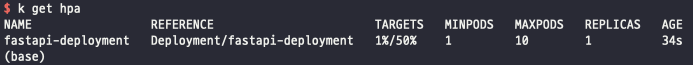
    
1. 부하 생성하기
   
    ```bash
    while sleep 0.01; do curl 34.133.155.185;done
    ```
    
    
    
1. HPA 동작확인 
   
    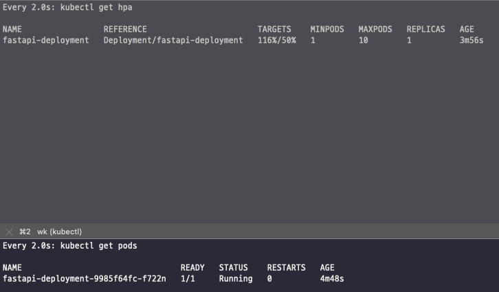
    
    Pod가 1개더 생성됨
    
    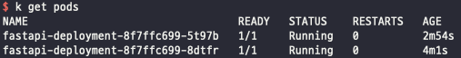
    

# 7. 앱 업데이트하기

새로운 버전을 배포하고 싶어.. 잠깐 서버를 죽이고 재빠르게 다시 업로드?? Nono..

- 롤링 업데이트
- 블루/그린 배포
- 카나리 배포

롤링 업데이트

1. 기존 애플리케이션 (기존 3 / New 0)
   
    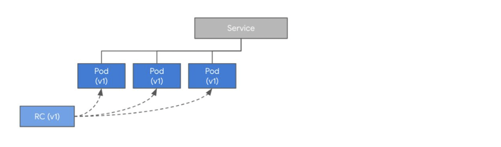
    
2. 새로운 버전 배포 (기존 2 / New 1)
   
    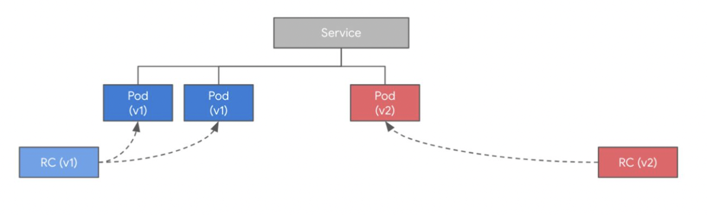
    
3. 새로운 버전 배포 (기존 1 / New 2)
   
    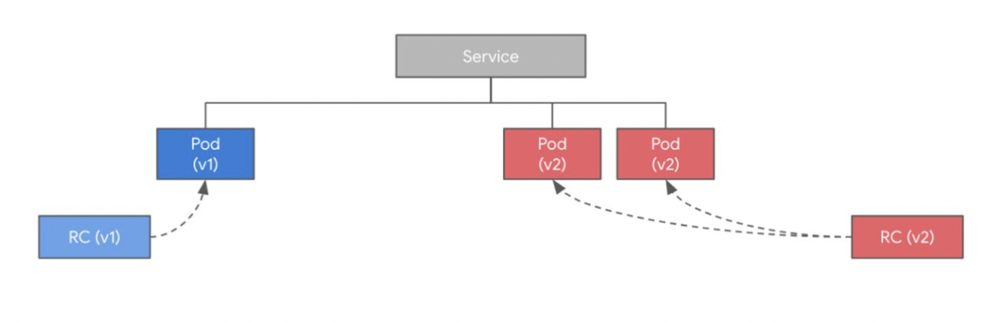
    
4. 배포 완료
   
    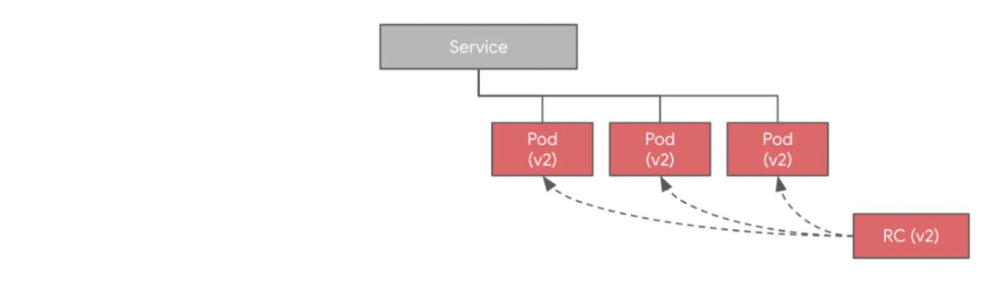
    

시간남으면 실습도 간단히 하겠습니다!!
