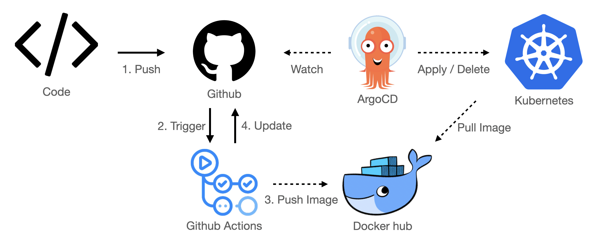
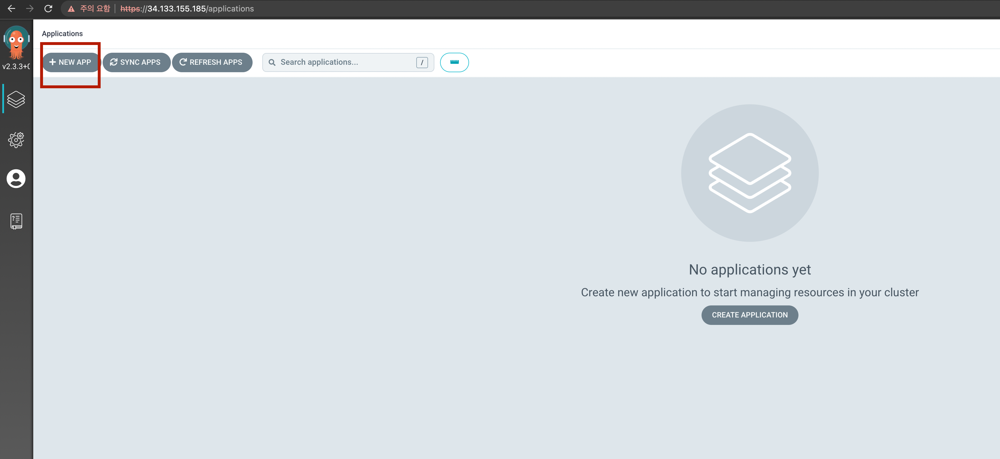
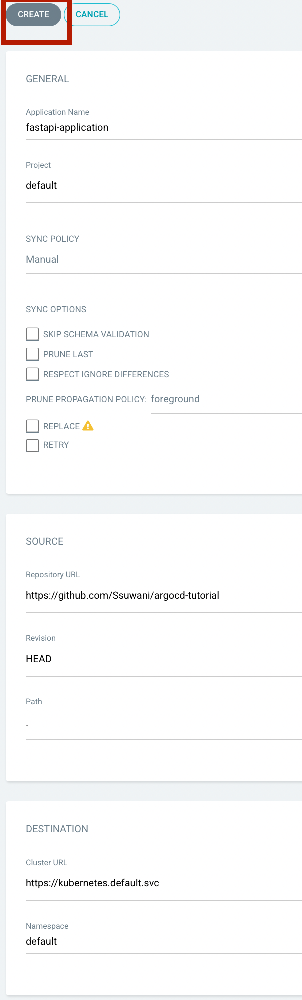
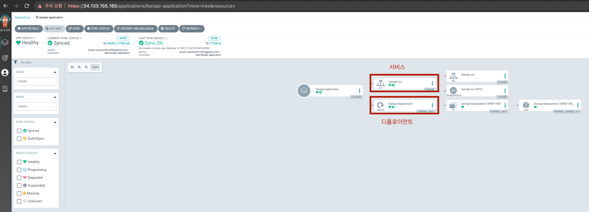
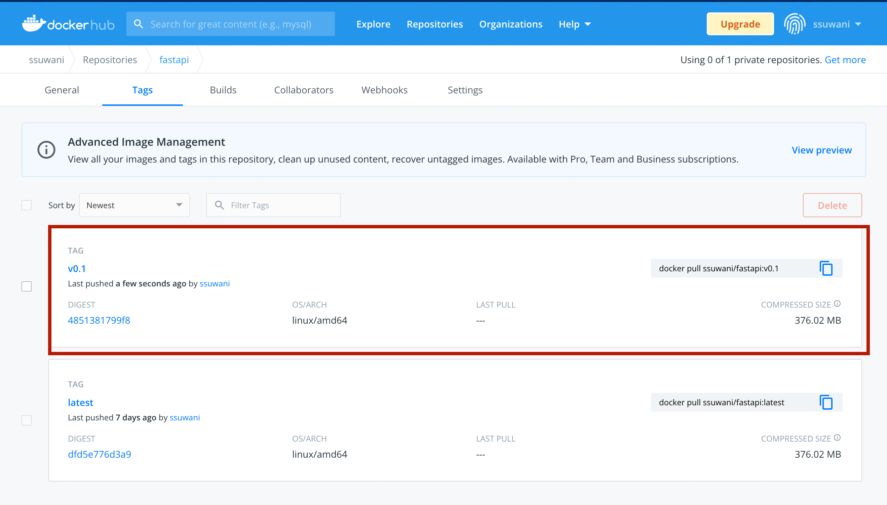
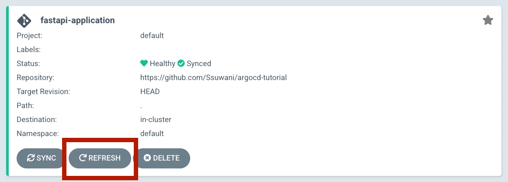
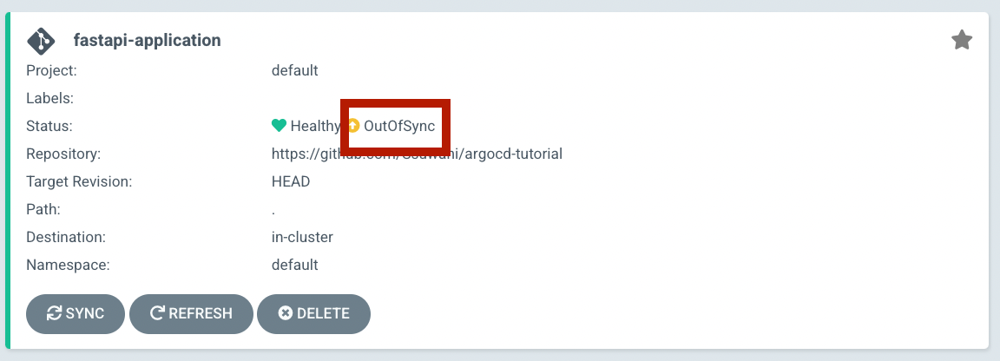
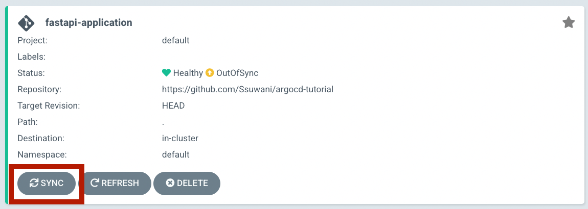
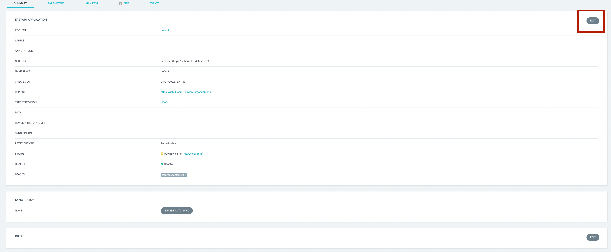

# Kubernetes에 ArgoCD 환경구성 및 튜토리얼

주차: 4

# 1. ArgoCD란

## A. GitOps란



CI/CD 파이프라인 중 특별히 Delivery에 초점을 가지고 탄생한 개념입니다.

항상 원천의 상태를 완벽히 반영하는 배포

**장점**

1. 현재 배포환경의 상태를 쉽게 파악할 수 있습니다. 배포환경에 들어가서 상태를 파악할 필요 없이 원천(배포 작업서)만 살펴보면 되기 때문입니다.
2. 빠르게 배포할 수 있게 됩니다. 단일한 방법으로 소프트웨어를 배포하여 표준화 시켰기 때문에 쉽게 배포 자동화를 할 수 있고 이것은 더 빠르고 지속적인 배포를 가능케 합니다.
3. 안정적으로 운영 환경에 배포할 수 있습니다. 사람의 손을 거치지 않기 때문에 운영 반영에 발생할 수 있는 human error를 최소화 할 수 있습니다. 배포를 관장하는 사람은 원천의 상태만 잘 확인하면 됩니다.

## B. GitOps의 구현체 ArgoCD

### ****1. 선언형 배포 작업 정의서****

### ****2. Git을 이용한 배포 버전 관리****

### ****3. 변경 사항 운영 반영 자동화****

### ****4. 자가 치유 및 이상 탐지****

# 2. GKE에 ArgoCD 설치하기

## A. 설치

```bash
kubectl create namespace argocd
kubectl apply -n argocd -f https://raw.githubusercontent.com/argoproj/argo-cd/stable/manifests/install.yaml
```


`argocd`라는 namespace가 생성되었다.


많은 양의 오브젝트가 생성된 것을 확인할 수 있다. 

앞서 Deployment과 Service를 생성하는 YAML 파일을 정의했던 것과 동일하게 아래의 링크에 있는 파일을 확인해보면 하나의 YAML 파일 안에 여러개의 오브젝트가 정의되어 있는 것을 확인할 수 있다.

https://raw.githubusercontent.com/argoproj/argo-cd/stable/manifests/install.yaml

## B. 네임스페이스

[https://kubernetes.io/ko/docs/concepts/overview/working-with-objects/namespaces/](https://kubernetes.io/ko/docs/concepts/overview/working-with-objects/namespaces/)

쿠버네티스에서, 네임스페이스는 단일 클러스터 내에서의 리소스 그룹 격리 메커니즘을 제공한다.

### 1. 조회

```bash
kubectl get namespaces
# kubectl get ns
```


GKE 클러스터 구성을 통해 4개의 네임스페이스가 자동으로 생성되었던 것을 알 수 있다.

- default
- kube-node-lease
- kube-public
- kube-system

앞서 실행한 대부분의 조회 및 실행 명령어는 `default` 네임스페이스 범위 안에서 실행되는 것이였다.

- `kubectl get pods`
- `kubectl get services`
- `kubectl create ~~~`
- `kubectl expose ~~~`

### 2. 생성

```bash
kubectl create namespace suwan
```


### 3. 생성한 네임스페이스에 오브젝트 생성

`hello-world-suwan.yaml`

```yaml
apiVersion: apps/v1
kind: Deployment
metadata:
  name: fastapi-deployment
  namespace: suwan # 새롭게 추가된 코드
  labels:
    app: fastapi
spec:
  replicas: 1
  selector:
    matchLabels:
      app: fastapi
  template:
    metadata:
      labels:
        app: fastapi
    spec:
      containers:
      - name: fastapi
        image: ssuwani/fastapi:latest
        ports:
        - containerPort: 8080
        resources:
          limits:
            cpu: 500m
          requests:
            cpu: 200m

---
apiVersion: v1
kind: Service
metadata:
  name: fastapi-svc
  namespace: suwan # 새롭게 추가된 코드
spec:
  selector:
    app: fastapi
  ports:
    - protocol: TCP
      port: 80
      targetPort: 8080
  type: LoadBalancer
```

```yaml
kubectl apply -f hello-world-suwan.yaml
```


### 4. 생성된 오브젝트 조회

조회를 위해 `kubectl get pods` 를 한다면 default namespace에서는 리소르르 찾을 수 없다는 에러가 나온다. 


우리는 `suwan` 이라는 네임스페이스에 Deployment와 Service를 생성했기 때문에 조회 또한 해당 네임스페이스에서 조회해야 한다.

```yaml
kubectl get deployment,service -n suwan
```


## C. ArgoCD 설치확인

### 1. 오브젝트 조회

```yaml
kubectl get all -n argocd
```

argocd 네임스페이스에서 조회할 수 있는 모든 오브젝트를 확인한다. 

- pod
- service
- deployment
- replicaset
- statefulset


### 2. ArgoCD 대시보드 접속을 위한 Service Type 변경

위의 사진에서 Cluster-IP 인 내부 IP만 조회되는 걸 확인할 수 있다.

이는 port-forwarding을 통해서 로컬에서도 접속이 가능하긴하다.

```bash
kubectl port-forward svc/argocd-server -n argocd 8080:443
```


이후 로컬에서 진행하고 있다면 `[localhost:8080](http://localhost:8888)` 로 접속이 가능하고 VM에서 진행하고 있다면 VM의 `EXTERNAL-IP:8080` 로 접속이 가능하다.

하지만 매번 port-forwarding을 해주는 작업은 번거로우므로 LoadBalancer 타입으로 변경하고자 한다.

```bash
kubectl patch svc argocd-server -n argocd -p '{"spec": {"type": "LoadBalancer"}}'
```

Cluster IP → LoadBalancer 로 변경한 뒤 외부 IP가 할당된 모습


### 3. ArgoCD default 계정으로 로그인

ArgoCD를 설치하면 default 계정을 부여해주는데 비밀번호는 직접 조회해서 알아내야 한다.

id: `admin`

pw: `kubectl -n argocd get secret argocd-initial-admin-secret -o jsonpath="{.data.password}" | base64 -d; echo` 의 결과


### 4. 로그인 성공 후 대시보드

로그인이 잘 되었을 때 나오는 대시보드


# 3. ArgoCD 기초

## A. 레포지토리 만들기

[https://github.com/new](https://github.com/new)

이동해 새로운 레포지토리를 생성합니다.

- **Repository name**: argocd-tutorial


## B. Deployment와 Service 정의

```bash
argocd-tutorial
├── fastapi-deployment.yaml
└── fastapi-service.yaml
```

`fastapi-deployment.yaml`

```bash
apiVersion: apps/v1
kind: Deployment
metadata:
  name: fastapi-deployment
  labels:
    app: fastapi
spec:
  replicas: 1
  selector:
    matchLabels:
      app: fastapi
  template:
    metadata:
      labels:
        app: fastapi
    spec:
      containers:
      - name: fastapi
        image: ssuwani/fastapi:latest
        ports:
        - containerPort: 8080
```

`fastapi-service.yaml`

```bash
apiVersion: v1
kind: Service
metadata:
  name: fastapi-svc
spec:
  selector:
    app: fastapi
  ports:
    - protocol: TCP
      port: 80
      targetPort: 8080
  type: LoadBalancer
```

## C. 레포지토리에 업로드

```bash
git add fastapi-deployment.yaml
git add fastapi-service.yaml

git commit -m "Add fastapi application"
git push
```


## D. ArgoCD App 정의하기

ArgoCD Dashboard에서 NewApp 클릭




- Application Name: App의 이름을 적습니다.
- Project: 프로젝트를 선택하는 필드입니다. 쿠버네티스의 namespace와 비슷한 개념으로 여러 App을 논리적인 project로 구분하여 관리할 수 있습니다.
- Sync Policy: Git 저장소의 변경 사항을 어떻게 sync할지 결정합니다. Auto는 자동으로 Git 저장소의 변경사항을 운영에 반영하고 Manual은 사용자가 버튼 클릭을 통해 직접 운영 반영을 해줘야 합니다.
- Repository URL: ArgoCD가 바라볼 Git 저장소를 의미합니다.
- Revision: Git의 어떤 revision (HEAD, master branch 등)을 바라 볼지 결정합니다.
- Path: Git 저장소에서 어떤 디렉토리를 바라 볼지 결정합니다. (dot(.)인 경우 root path를, 디렉토리 이름을 적으면 해당 디렉토리의 배포 정의서만 tracking 합니다.)
- Cluster: 쿠버네티스의 어느 클러스터에 배포할지를 결정합니다.
- Namespace: 쿠버네티스 클러스터의 어느 네임스페이스에 배포할지를 결정합니다.
- Directory Recurse: path아래의 디렉토리를 재귀적으로 모니터링하여 변경 사항을 반영합니다.

출처: [https://coffeewhale.com/kubernetes/gitops/argocd/2020/02/10/gitops-argocd/](https://coffeewhale.com/kubernetes/gitops/argocd/2020/02/10/gitops-argocd/)

**작성한 내용**

- Application Name: fastapi-application
- Project: default
- Repository URL: [https://github.com/Ssuwani/argocd-tutorial](https://github.com/Ssuwani/argocd-tutorial)
- Path: .
- Cluster URL: https://kubernetes.default.svc
- Namespace: default



## E. 동작확인

생성된 애플리케이션


SYNC 버튼 클릭 → SYNCHRONIZE

싱크가 잘 된 모습


프로젝트 상세정보



Kubectl로 생성된 Deployment,Service 확인하기

```bash
k get deployment,service
```


# 4. ArgoCD 심화 (feat. Github Actions)

새로운 버전으로 업데이트 한다는 것은 Deployment의 Container의 Docker Image가 변경된다는 의미이다. 즉, 새로운 버전은 새로운 도커 이미지를 의미한다. 하지만 여기서 문제는 `latest`라는 태그이다. 태그를 명시하지 않으면 자동으로 부여되는 `latest` 는 ArgoCD가 다른 도커 이미지라 판단하지 못하고 Pull 받지 못한다. 또한 개발자 입장에서도 `latest` 는 정보가 부족하다.

따라서 Tag를 변경해 줄 필요가 있다.

## A. 새로운 도커 이미지 업로드 (tag: v0.1)

tag: v0.1은 루트 라우트에 접근하면 “안녕하세요. 저는 v0.1입니다.”를 반환하는 애플리케이션이다.

### 1. Define main.py

```python
from fastapi import FastAPI
import uvicorn

app = FastAPI()

@app.get("/")
async def root():
    return f"안녕하세요. 저는 v0.1입니다. 😎"

if __name__ == "__main__":
    uvicorn.run(app="main:app", host='0.0.0.0', port=8080)
```

### 2. Define Dockerfile

```docker
FROM python:3.8
RUN pip install "fastapi[all]"
COPY . /app
WORKDIR /app
CMD ["python", "main.py"]
```

### 3. Docker build

```bash
docker build -t ssuwani/fastapi:v0.1 .
```

### 4. Docker Push

```bash
docker push ssuwani/fastapi:v0.1
```



## B. 기존의 deployment.yaml 업데이트

deployment를 업데이트 한다는 것은 argocd-tutorial 레포지토리에 있는 fastapi-deployment.yaml 파일을 수정하면 되는 것이다.

기존: `ssuwani/fastapi:latest`

수정: `ssuwani/fastapi:v0.1`

```bash
git add fastapi-deployment.yaml

git commit -m "Update fastapi deployments (latest -> v0.1)"

git push
```

## C. ArgoCD Application SYNC

ArgoCD Dashboard에서 REFRESH를 클릭해보면 Out of Sync를 확인할 수 있다. 변동사항이 있다는 의미이다.





ArgoCD 애플리케이션을 생성할 때 Sync Policy를 Manual로 설정했기 때문에 수동으로 SYNC를 클릭해줘야 한다.



하나의 Pod가 생성되어 있는 상태에서 새로운 Pod가 생성되고 있는 것을 확인할 수 있다.

이는 `kubectl get pods` 를 통해서도 동일하게 확인할 수 있다.


업데이트 완료


그리고 기존의 Service에 접속하면 다음과 같은 결과를 확인할 수 있다.

[http://35.232.126.44/](http://35.232.126.44/)


## D. Github Actions를 이용해 위의 과정을 자동화


1. 사용자 코드 Push
2. Github Actions Trigger
3. Docker build & push
4. Github에 있는 `fastapi-deployment.yaml` 의 이미지 태그 업데이트
5. ArgoCD의 Sync Policy manual to automatic

```bash
argocd-tutorial
└── fastapi
    ├── base
    │   ├── deployment.yaml
    │   ├── kustomization.yaml
    │   └── service.yaml
    ├── overlays
    │   └── dev
    │       └── kustomization.yaml
    └── src
        ├── dockerfile
        └── main.py
```

### 1. 사용자 코드 Push (main.py)

v0.2로 업데이트 하고자 한다. 이는 “안녕하세요. 저는 v0.2입니다.”를 반환하는 애플리케이션이다.

`fastapi/src/main.py`

```python
from fastapi import FastAPI
import uvicorn

app = FastAPI()

@app.get("/")
async def root():
    return f"안녕하세요. 저는 v0.2입니다. 😎"

if __name__ == "__main__":
    uvicorn.run(app="main:app", host='0.0.0.0', port=8080)
```

`fastapi/src/dockerfile`

```docker
FROM python:3.8
RUN pip install "fastapi[all]"
COPY . /app
WORKDIR /app
CMD ["python", "main.py"]
```

### 2. Tag Push

Git으로 코드를 관리할 때 Tag를 생성할 수 있고 Tag를 Push할 수 있다.

이미지의 버전을 업데이트 하기 위해선 `v0.2` 와 같은 정보를 Github Actions에게 알려줘야 한다.

**태그 생성하기**

```docker
git tag v0.2
```

태그 Push하기

```docker
git push origin v0.2
```

### 3 Github Actions Trigger

Tag로 Push가 되었을 때 Github Actions가 Trigger 되게 할 수 있다.

```yaml
name: CI

on:
  create:
    tags:
      - "v*"
```

위와 같이 작성하면 `v` 로 시작하는 tag가 생성되었을 때 Trigger되는 Workflow이다.

### 4. Catch Tag

이 태그를 Github Actions에서 사용할 수 있어야 도커로 이미지 빌드할 때 태그를 지정할 수 있다.

```yaml
- name: Set env # # tag v0.2 -> RELEASE_VERSION = 0.2
  run: |
    echo "RELEASE_VERSION=${GITHUB_REF#refs/*/v}" >> $GITHUB_ENV
```

GITHUB_ENV에 RELEASE_VERSION이라는 환경변수 추가. 값은 0.2

이후에 사용은 `${{ env.RELEASE_VERSION }}`으로 할 수 있다.

### 5. Docker build & push

2주차에 했던 Github Actions에서 가져왔다.

```yaml
jobs:
  dockerize:
    runs-on: ubuntu-latest
    steps:
      - name: Docker Login
        uses: docker/login-action@v1.14.1
        with:
          username: ssuwani
          password: ${{ secrets.DOCKER_PASSWORD}} # secret 가져오기

      - name: Checkout
        uses: actions/checkout@v3.0.0

      - name: Docker build
        run: docker build -t ssuwani/fastapi:${{env.RELEASE_VERSION}} fastapi/src/

      - name: Docker push
        run: docker push ssuwani/fastapi:${{env.RELEASE_VERSION}}
```

### 6. deployment 업데이트

Github Actions에서 Docker push가 끝난 뒤 Github의 `fastapi-deployment.yaml`가 업데이트 되어야 한다. 

이를 위한 다양한 방법이 있을 수 있지만 `kustomize`라는 툴을 사용하는 것이 일반적이라 생각한다.

```yaml
- name: Setup Kustomize
  uses: imranismail/setup-kustomize@v1

- name: Set new image tag
  run: |
    cd fastapi/overlays/dev
    kustomize edit set image ssuwani/fastapi:${{ env.RELEASE_VERSION }}
    cd ../../../
    git config --global user.name ${{ github.repository_owner }}
    git config --global user.email "jsuwan961205@gmail.com"
    git add .
    git commit -m 'Publish new version ${{ env.RELEASE_VERSION }} to dev'
    git push origin HEAD:refs/heads/master --force
```

### 7. 전체코드

`.github/workflows/ci.yml`

```yaml
name: CI

on:
  create:
    tags:
      - "v*"

jobs:
  dockerize:
    runs-on: ubuntu-latest
    steps:
      - name: Docker Login
        uses: docker/login-action@v1.14.1
        with:
          username: ssuwani
          password: ${{ secrets.DOCKER_PASSWORD}} # secret 가져오기

      - name: Checkout
        uses: actions/checkout@v3.0.0

      - name: Set env # # tag v0.2 -> RELEASE_VERSION = 0.2
        run: |
          echo "RELEASE_VERSION=${GITHUB_REF#refs/*/v}" >> $GITHUB_ENV

      - name: Docker build
        run: docker build -t ssuwani/fastapi:${{ env.RELEASE_VERSION }} fastapi/src/

      - name: Docker push
        run: docker push ssuwani/fastapi:${{env.RELEASE_VERSION}}
      
      - name: Setup Kustomize
        uses: imranismail/setup-kustomize@v1

      - name: Set new image tag
        run: |
          cd fastapi/overlays/dev
          kustomize edit set image ssuwani/fastapi:${{ env.RELEASE_VERSION }}
          cd ../../../
          git config --global user.name ${{ github.repository_owner }}
          git config --global user.email "jsuwan961205@gmail.com"
          git add .
          git commit -m 'Publish new version ${{ env.RELEASE_VERSION }} to dev'
          git push origin HEAD:refs/heads/master --force
```

### 8. 기존 ArgoCD 애플리케이션 수정

Edit 버튼을 클릭하여 수정한다.



PATH와 SYNC POLICY를 변경한다.

PATH: . → fastapi/overlays/dev

SYNC POLICY: Manual → Auto Sync


### 9. main.py 업데이트 & Tag Push

지금까지의 내용은 main.py가 업데이트 되면 이후에 필요한 모든 과정을 자동화 한 것이다.

