# 모델을 배포하기 위한 다양한 툴과 디자인 패턴

날짜: 2022년 5월 4일<br/>
주차: 5

# 1. 모델 배포의 개념과 툴

개인적으로 배포와 서빙은 같은 개념이라고 생각합니다. 따라서 혼용하여 사용하도록 하겠습니다.

모델 서빙이란 사용자에게 모델 예측 결과를 효율적으로 전달하는 방식입니다.


<br/>

## A. 함수의 관점

모델은 하나의 함수와 같이 생각하시면 좋을 거 같습니다.

일반적인 함수

```python
def get_sqrt(num):
    return math.sqrt(num)

result = get_sqrt(9)

result # 3
```

num → get_sqrt → result

모델(MNIST 분류)

```python
model = tf.keras.models.load_model(MODEL_PATH)

predictions = model([image]) # single image with batch

# predictions[0]: [1,0,0,0,0,0,0,0,0,0]

result = np.argmax(predictions[0]) # 0
```

image → model → result

<br/>

## B. 배포를 위한 다양한 툴

함수의 관점으로 모델을 바라보기 시작했다면 계속해서 사용자 입력을 받는 서비스를 만들어봅시다. 이 서비스는 사용자 입력을 계속해서 기다려야 합니다. 그리고 입력을 받아 결과를 반환할 수 있어야 합니다. 입력을 받기 위해선 어떠한 통로가 있어야합니다. 이는 컴퓨터의 고유한 주소인 IP를 이용합니다.

### 1. 웹 애플리케이션을 위한 라이브러리

이러한 역할을 해주는 서비스를 만들기 위해 다양한 라이브러리가 있습니다.

- Flask
- FastAPI

두 라이브러리는 사실 웹 애플리케이션을 만들기 위한 라이브러리입니다. 이는 HOST URL로 사용자 접근이 발생하면 결과를 반환합니다. 여러분이 [www.naver.com](http://www.naver.com) 에 접속하면 네이버 홈페이지 정보를 네이버가 반환해주는 것과 동일한 이야기입니다. 

이전에 이야기했듯이 사용자에게 배포하기 위해선 입력을 받아 결과를 반환하는 서버를 구성하면 됩니다. 이를 위해선 두 라이브러리를 사용하면 됩니다. 

하지만 모델의 수가 많아지고 설정이 복잡해지고 배치단위로 데이터를 받아 처리해야 한다면 웹 애플리케이션 개발을 위한 도구인 `Flask`, `FastAPI` 로 작업하기 힘들어집니다.(구현할 수는 있는 걸로 알고 있습니다..)

### 2. 배포에 특화된 라이브러리

그래서 Model Serving에 특화된 라이브러리들이 등장했습니다.


더욱 많은 라이브러리들이 있습니다. 위에 소개된 4개의 라이브러리 중에서도 `BentoML`에 대해서만 알아보도록 하겠습니다. (`mlflow` 는 바로 다음 6주차에 배울 것입니다.)

BentoML은 0점대 버전에서도 [Line](https://engineering.linecorp.com/ko/blog/mlops-bentoml-1/)등 다양한 기업에서 사용했었는데 아주 최근 1.x 버전이 릴리즈 되었습니다. 다양한 ML 라이브러리의 모델을 지원하는 BentoML은 되게 좋은거 같습니다!!

<br/>

<br/>

# 2. 배포 해보기

모델을 배포하기 위해선 모델이 있어야겠죠. 그 중에서도 학습된 모델이 있어야 할 것입니다.*(학습이 안된 모델에 입력을 넣으면 원하는 결과가 나오지 않겠죠?)*

마지막 과정인 모델 저장이 없다면 서버를 킬때마다 모델 학습을 시켜줘야 할 것입니다.😱


Tensorflow를 사용하여 모델을 저장하고 모델을 불러오기 위해선 다음과 같은 과정이 필요합니다.

```python
model_path = "mnist_model"

# 모델 저장
model.save(model_path)

# 모델 로드
model = tf.keras.models.load_model(model_path)
```

그럼 MNIST 분류를 위한 모델을 저장하는 것부터 저장된 모델을 불러와 `FastAPI`, `BentoML`을 이용해 모델 서빙을 해보겠습니다.

<br/>

## A. 모델 저장하기

```python
import tensorflow as tf

mnist = tf.keras.datasets.mnist

(x_train, y_train), (x_test, y_test) = mnist.load_data()
x_train, x_test = x_train / 255.0, x_test / 255.0

model = tf.keras.models.Sequential([
  tf.keras.layers.Flatten(input_shape=(28, 28)),
  tf.keras.layers.Dense(128, activation='relu'),
  tf.keras.layers.Dropout(0.2),
  tf.keras.layers.Dense(10, activation='softmax')
])

model.compile(optimizer='adam',
              loss='sparse_categorical_crossentropy',
              metrics=['accuracy'])

model.fit(x_train, y_train, epochs=3)

model.evaluate(x_test,  y_test, verbose=2)

model_path = "mnist_model.h5"
model.save(model_path)
```

저희는 MNIST 분류라는 간단한 모델을 학습하지만, 위의 모델 학습을 GPU가 필요하다는 가정하에 Colab에서 학습을 진행하였고 아래의 사진과 같이 `mnist_model.h5` 모델이 잘 저장된 것을 확인할 수 있습니다.

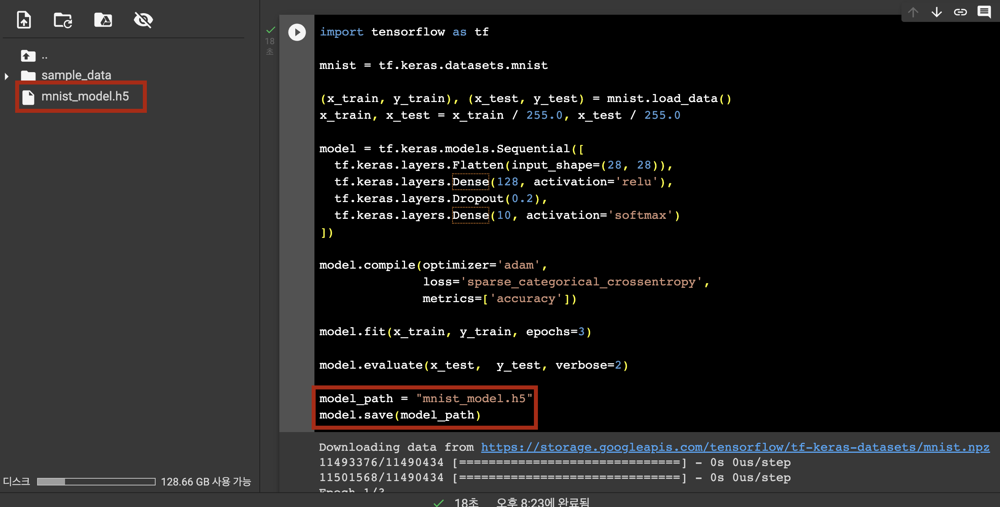

이렇게 생성된 모델을 VM에서 사용하기 위해선 VM에 모델이 있어야 합니다.(VM에서 바로 학습을 시켰다면 필요없는 과정이겠죠?)

VM으로 모델을 옮기기 위해 다음 과정을 진행해야 합니다.

1. Colab에서 모델 다운로드
2. GCS에 업로드
3. `gsutil` 을 사용해 GCS에서 모델 다운로드

1. Colab에서 모델 다운로드
   
    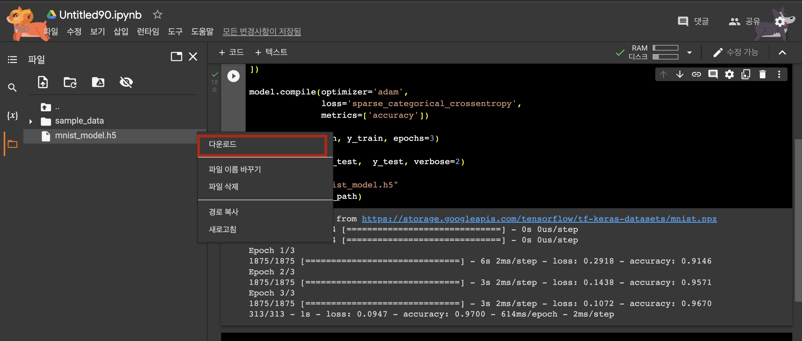
    
2. GCS에 모델 업로드
   
    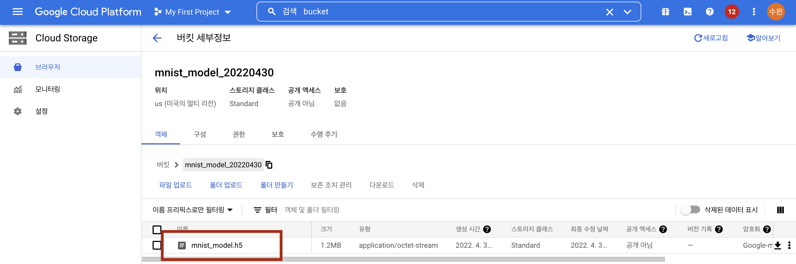
    
1. gsutil을 사용해 GCS에서 모델 다운로드
   
    ```bash
    gsutil cp gs://mnist_model_20220430/mnist_model.h5 mnist_model.h5
    
    # 여러분의 버킷으로 지정하지 않으면 권한 에러가 날거에요!
    # gsutil cp gs://BUCKET_NAME/OBJECT_NAME SAVE_TO_LOCATION
    ```
    
    
    

그러면 드디어 VM에 학습된 모델이 있게 됐습니다.

<br/>

## B. 모델 동작 확인하기

가져온 모델이 잘 동작하는지 확인은 해봐야겠죠..? 

저희가 만든 MNIST 분류 모델은 테스트 이미지가 있어야 동작을 확인하기 좋을 거 같습니다. 테스트 데이터로 1개의 MNIST 이미지를 가져와보겠습니다.


```bash
sudo apt install wget
wget https://raw.githubusercontent.com/Ssuwani/mlops/master/mnist/CNN/asset/img_1.jpg
```

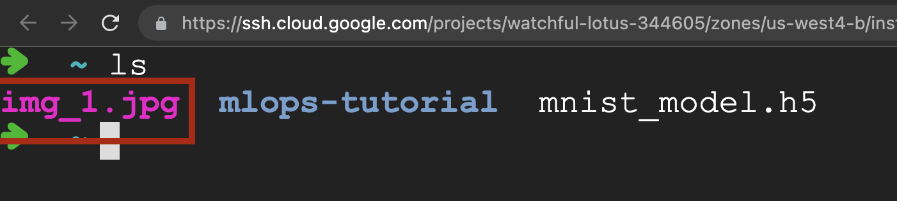

이제 이 데이터를 모델에 넣어서 결과를 봐야겠죠?

그전에 VM에 pip가 설치가 되어 있지 않아 설치해주는 과정이 필요하네요 ㅠㅠ pip 설치 후 Tensorflow도 설치해줍시다.

```bash
sudo apt-get install python3-pip
pip3 install --upgrade pip
pip3 install tensorflow
```

`test_single_image.py` 파일을 하나 만들고 아래의 코드를 넣어주세요.

```python
# nano test_single_image.py

import tensorflow as tf
import numpy as np
import argparse

parser = argparse.ArgumentParser(description='Process some integers.')
parser.add_argument(
    '--image_path',
    type=str,
    help="input single image"
)
args = parser.parse_args()
image_path = args.image_path

image = tf.keras.utils.load_img(image_path)
image = image.convert("L")
image = np.array(image) / 255.0
image = image.reshape(-1, 28, 28, 1)

model = tf.keras.models.load_model("mnist_model.h5")
predictions = model([image])
result = np.argmax(predictions[0])

print(f"예측한 값은: {result}입니다.")
```

확인

```bash
python3 test_single_image.py --image_path 1.jpg

# 예측한 값은: 1입니다.
```

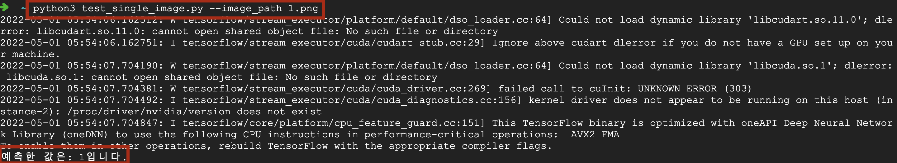

손글씨 1을 넣어서 결과 1을 받았다. 제대로 된 결과가 나오는 모델이라고 생각해도 될 것 같다. 이제 이를 이용해 FastAPI로 배포서버를 만들어보자.

<br/>

## C. FastAPI

FastAPI는 공식 홈페이지에 한국어를 제공한다.

https://fastapi.tiangolo.com/ko/

공식 홈페이지 예제를 참고하여 모델을 배포하는 서버를 만들어보겠습니다.

### 1. app.py 정의 및 실행

앞으로 만들 서버는 사용자 입력을 대기하다가 결과를 반환하면 됩니다. 그러기 위해선 모델이 불러와 져 있어야 합니다.*(사용자 입력때마다 학습을 시킬 순 없겠죠?)*

```python
app.py
from io import BytesIO
from fastapi import FastAPI, File, UploadFile
from PIL import Image
import tensorflow as tf
import uvicorn
import numpy as np

app = FastAPI()

# 모델 불러오기
def load_model():
    model_path = "mnist_model.h5"
    model = tf.keras.models.load_model(model_path)
    return model

# 이미지 전처리
def data_preprocessing(image):
    input_shape = model.layers[0].input_shape
    image = image.resize((input_shape[1], input_shape[2]))
    image = image.convert("L")
    image = np.array(image) / 255.0
    batch_image = np.array([image])  # (28, 28) to (1, 28, 28)
    return batch_image

# root route 정의
@app.get("/")
def root_route():
    return {"error": "use POST /prediction instead of root route"}

# prediction route 정의 
@app.post("/prediction")
async def prediction_route(image: UploadFile = File(...)):
    contents = await image.read()
    image = Image.open(BytesIO(contents))
    batch_image = data_preprocessing(image)
    predictions = model(batch_image)
    result = np.argmax(predictions[0])
    return {f"예측한 값은: {result}입니다."}

if __name__ == "__main__":
    # 모델 불러온 뒤 앱 실행
    model = load_model()
    uvicorn.run(app="app:app", host='0.0.0.0', port=3389)
```

**실행**

```bash
python3 app.py
```

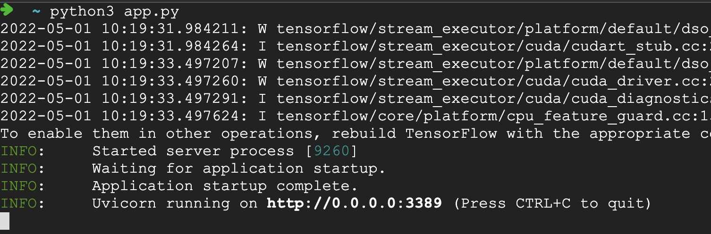

### 2. 접근 및 결과 확인

VM에 할당된 외부 IP:3389 로 접속가능 ex) http://34.125.175.72:3389/

- root route에 접근: http://34.125.175.72:3389/

    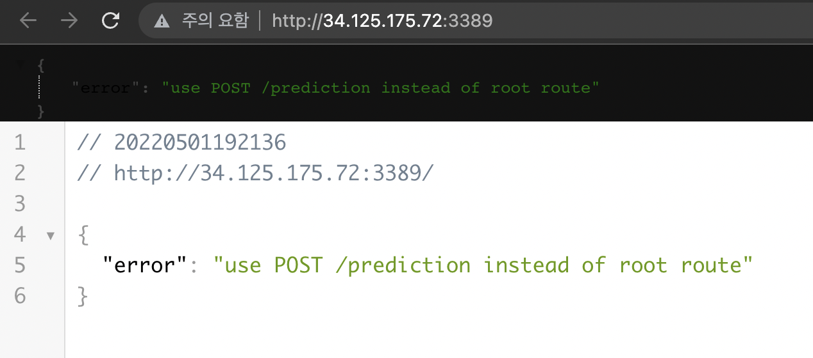

- prediction route에 접근: http://34.125.175.72:3389/prediction

    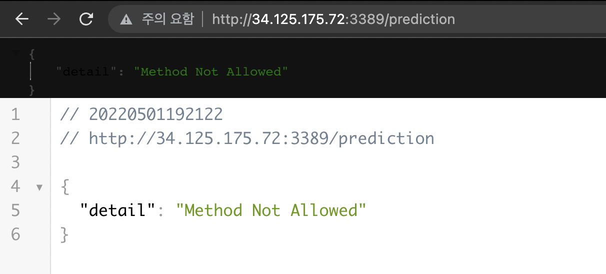

    prediction route는 POST 방식으로 정의했기 때문에 데이터와 함께 접근해야 한다.

여기서 FastAPI는 Swagger UI를 제공한다.

- Swagger UI: http://34.125.175.72:3389/docs

    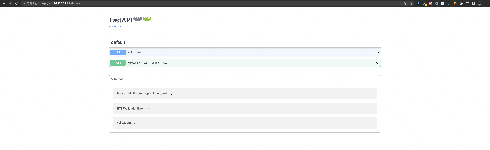

### 3. Prediction Route 접근

- Swagger UI

    http://34.125.175.72:3389/docs에서 /prediction을 클릭하면 Try it out 버튼을 볼 수 있다.

    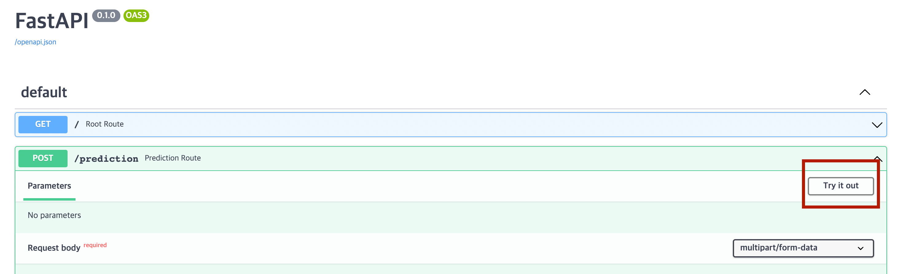

    이미지를 선택한 뒤 Execute 버튼을 클릭하면 된다.

    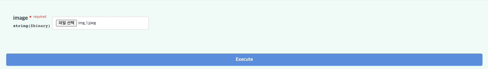

    결과

    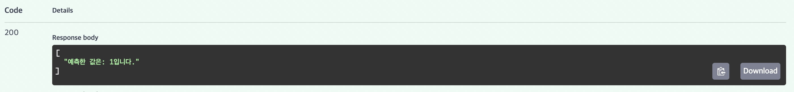

    [ "예측한 값은: 1입니다." ]

- curl

    ```bash
    curl -F "image=@1.jpg" 34.125.175.72:3389/prediction
    ```

    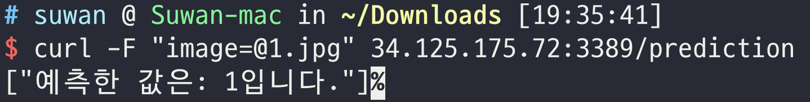

    이 결과를 보기 위해선 curl을 수행하는 위치에 `1.jpg` 이미지가 존재해야 한다.

<br/>

## D. BentoML

BentoML은 많은 사람들이 사용하는 모델 배포를 위한 라이브러리지만 0.13.x 버전에서 최근에서야 1.X 버전이 나왔습니다.

주요 특징은 다음과 같습니다.

- Online API Serving(실시간 처리) / Offline Batch Serving(주기적으로 처리)
- 고성능(Flask의 100배 가량이라함)
- 다양한 ML Framework 지원(TFServing은 Tensorflow로 저장된 SavedModel만 가능)
- 도커라이징이 쉬움(Kubernetes에 배포가 편리함)
- 모델 관리를 위한 웹 대시보드 지원
- Swagger UI 지원

출처: https://yuevelyne.tistory.com/entry/BentoML-Machine-Learning-Model-Serving-2-BentoML이란-주요-특징

이번에 저희는 1.x 버전을 사용해보려 합니다. 최신 버전을 받고 CLI를 사용함에 있어 VM의 root 환경에 설정할 때 어려움이 있어 가상환경을 위한 툴인 virtualenv를 사용해보고자 합니다.

저는 1.x 버전을 처음 사용해봤는데 이전 버전에 비해 더욱 편리하게 서빙을 할 수 있게 된 것 같습니다. bentoml을 통해 모델을 저장만하면 모델 저장소에 모델이 등록되는 것도 되게 좋은거 같습니다.

### 0. virtualenv 환경설정

vm(ubuntu)에서 진행하였습니다.

```bash
# virtualenv 설치
sudo apt install virtualenv -y

# 가상환경 만들기 -> env 폴더가 생성됨
virtualenv -p python3 env

# 가상환경 활성화
source env/bin/activate
```

가상환경이 제대로 활성화가 되었으면 아래와 같이 명령줄 앞에 (env)라고 표기되어 있어야 합니다.

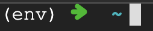

### 1. 설치 (가상환경 안에서 실행)

```bash
pip install bentoml --pre # 1.x 버전 설치
pip install tensorflow pillow
```

### 2. 모델 저장

BentoML 서비스를 위해 BentoML 라이브러리를 이용해 모델을 저장해보겠습니다.

```python
import tensorflow as tf
import bentoml

tf_model = tf.keras.models.load_model("mnist_model.h5")
bentoml.tensorflow.save("bento_mnist_model", tf_model)
```

이는 BentoML이 관리하는 모델 저장소에 모델을 저장하기 위함입니다.

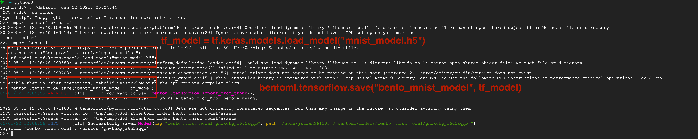

모델 저장소에 있는 모델 확인

```bash
bentoml models list
```


### 3. 서비스 정의

서비스는 BentoML의 서빙로직이 동작하는 핵심 요소입니다. 모델 저장소에 저장된 모델을 불러와 서비스를 생성할 수 있습니다.

```python
# service.py
import numpy as np
import bentoml
from bentoml.io import Image, NumpyNdarray

# 가장 최신의 model을 가져옵니다.
mnist_clf_runner = bentoml.tensorflow.load_runner("bento_mnist_model:latest")

svc = bentoml.Service("mnist_classifier", runners=[mnist_clf_runner])

@svc.api(input=Image(pilmode="L"), output=NumpyNdarray())
def classify(imgs) -> np.ndarray:
    imgs = np.array(imgs)
    imgs = imgs / 255.0
    result = mnist_clf_runner.run(imgs)
    return result
```

### 4. 서버 실행

```bash
bentoml serve service.py --host='0.0.0.0' --port=3389
```


### 5. 실행 확인

http://34.125.175.72:3389/ 에 접속하면 Swagger UI를 확인할 수 있고 테스트 이미지를 넣어서 결과를 확인할수도 있다. 또한, 서버가 잘 동작하는지 확인하기 위한 `health` 체크도 지원한다.

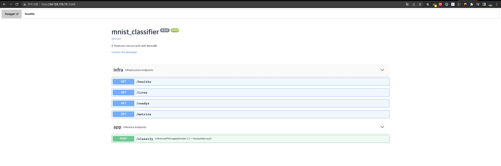