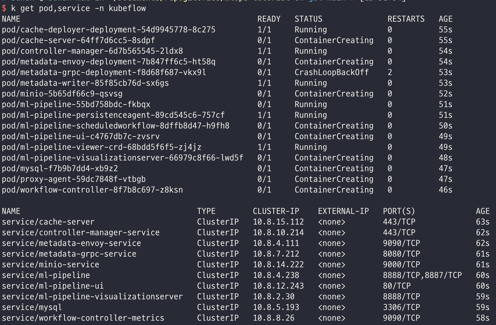
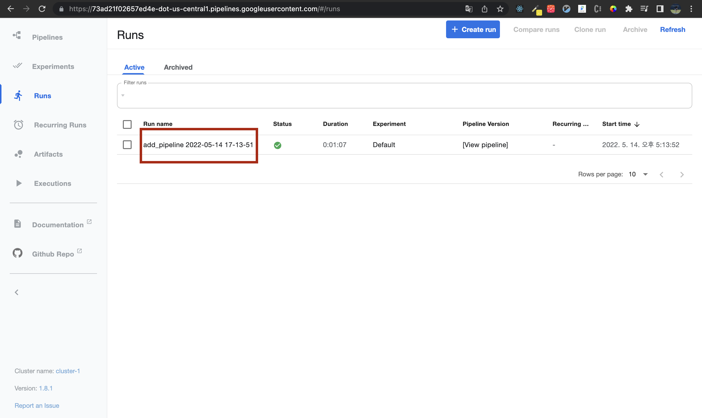
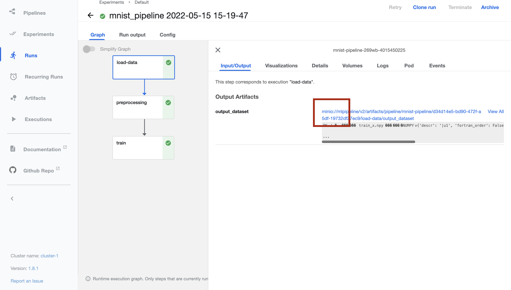
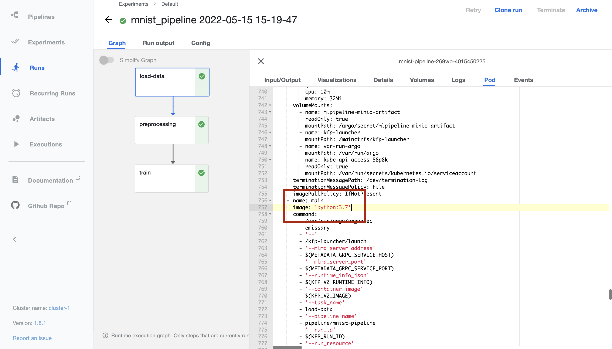
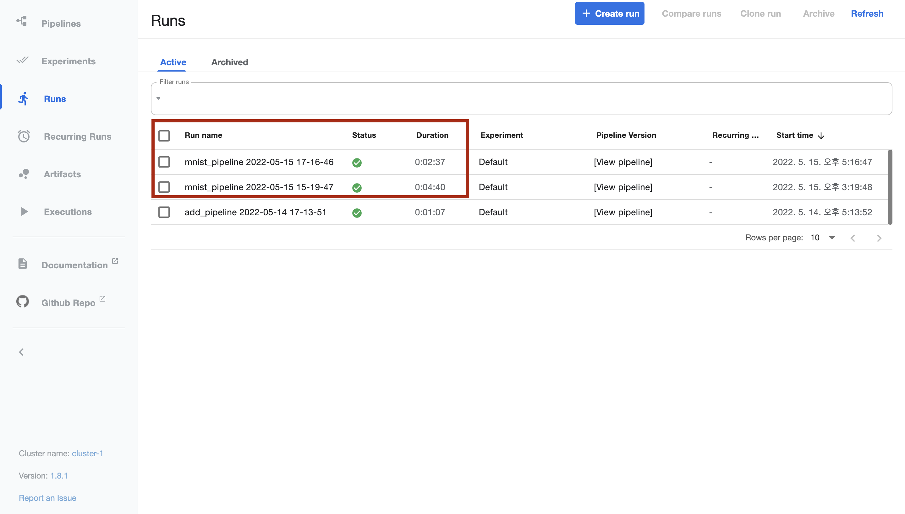
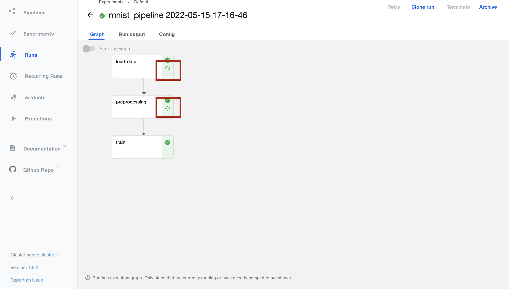

# kubeflow pipelines를 이용한 학습 파이프라인 설계

# 1. Kubeflow pipeline 개요

## 1.1 파이프라인이란

파이프라인은 기계 학습 작업 전체에 대한 독립 실행 워크플로입니다. 조금 더 쉽게 이야기를 MNIST를 예로 설명을 해보면 MNIST 학습을 위해서 다음과 같은 과정을 거칩니다.

1. 데이터 불러오기
2. 데이터 전처리하기
3. 모델 정의 및 모델 학습
4. 모델 평가

이 과정은 사실 MNIST 뿐만 아니라 지금 대부분의 머신러닝 모델학습을 위해 동일한 과정을 거칩니다. 그리고 위의 각 단계는 서로 의존성을 가지고 있죠? 불러온 데이터를 가지고 전처리를 하고 전치한 데이터를 가지고 모델 학습을 합니다. 모델 학습의 결과를 가지고 모델을 평가하죠.

저희가 계속해서 다루고 있는 MNIST 데이터 같은 경우에는 데이터를 불러오기 위해`tf.keras.datasets.mnist.load_data()` 함수를 사용해서 정말 빠르고 간단하게 데이터를 가져오죠. 그리고 간단한 모델을 주로 사용하고 모델을 학습시키는데 한 에폭당 10초정도 밖에 소요되지 않죠..

이게 일반적인것은 아니에요. 각 단계가 오래 걸리고 문제가 될 수 있을만한 상황이 자주 발생하기도해요. 

오래 걸리는 각 단계들을 독립적으로 실행되도록 해줍니다.

## 1.2. Kubeflow pipelines를 사용하는 이유

바로 앞에 “오래 걸리는 각 단계들을 독립적으로 실행되도록 해줍니다”라고 했죠. 저렇게 말을 한 이유는 MNIST 학습을 위해선 굳이 Kubeflow Pipelines로 각 단계를 독립적으로 실행되도록 하지 않는게 좋다고 생각해요. 데이터를 불러오는데 몇초면 되는데 독립적으로 실행하기 위해서 내부적으로 더 복잡한 과정을 거쳐야 하거든요. 그러면 어떠한 장점이 있는 걸까요?

제가 생각할 때 가장 강력한 이유는 캐싱이라고 생각해요.

모델을 학습할 때 최적화 함수를 adam → sgd로 변경해서 실험을 해보려고해요. 그러면 앞에서 실행했던 데이터 불러오기, 데이터 전처리 등의 과정이 또 다시 수행되어야 겠죠? 그런데 이 데이터를 불러오는데 30분이 걸린다고 가정해보세요.. ㅠㅠ Kubeflow pipelines를 사용해 이 오래 걸리는 과정을 입력이 변경되는 경우에만 수행하면 되도록 만들어줍니다.

# 2. Kubeflow pipelines 튜토리얼

Kubeflow Pipelines은 쿠버네티스 위에서만 동작합니다. 그러면 쿠버네티스 클러스터를 만들어야겠죠? 그리고 쿠버네티스 클러스터를 관리하는 VM을 하나 만들어줍시다. 

3주차 내용의 [2. 쿠버네티스 클러스터 생성하기](https://github.com/Ssuwani/mlops-tutorial/tree/main/3-gke-tutorial#2-%EC%BF%A0%EB%B2%84%EB%84%A4%ED%8B%B0%EC%8A%A4-%ED%81%B4%EB%9F%AC%EC%8A%A4%ED%84%B0-%EC%83%9D%EC%84%B1%ED%95%98%EA%B8%B0)를 따라서 진행하시면 됩니다.(한번 더 하지 않을게요)

## 2.1. Kubeflow Pipelines 설치

[공식문서](https://www.kubeflow.org/docs/components/pipelines/installation/standalone-deployment/)를 참고해서 설치법을 작성했습니다.

```bash
export PIPELINE_VERSION=1.8.1
kubectl apply -k "github.com/kubeflow/pipelines/manifests/kustomize/cluster-scoped-resources?ref=$PIPELINE_VERSION"
kubectl wait --for condition=established --timeout=60s crd/applications.app.k8s.io
kubectl apply -k "github.com/kubeflow/pipelines/manifests/kustomize/env/dev?ref=$PIPELINE_VERSION"
```

잘 실행했으면 kubeflow라는 네임스페이스에 리소스들이 생성됩니다. 아래와같이 파드와 서비스를 조회해보겠습니다. 현재 저는 불안해보이는 파드들이 있지만 조금 더 기다려보면 잘 설치가될겁니다.



저는 2분정도의 시간이 지나고 나니 모두 Running으로 변경된게 보이네요!! 


## 2.2 조회

저희에게 Kubeflow Pipelines가 잘 설치되었는지 확인하는 방법으로는 대시보드를 확인하는 방법이 있습니다.

위의 사진에서 서비스를 조회해보면 모두 ClusterIP 이지만 Kubeflow Pipelines에서는 공개 URL을 가져와 Kubeflow Pipelines UI에 접근할 수 있게 해줍니다.

```bash
kubectl describe configmap inverse-proxy-config -n kubeflow | grep googleusercontent.com
```

저의 경우 아래와 같은 URL를 받았네요


[73ad21f02657ed4e-dot-us-central1.pipelines.googleusercontent.com](http://73ad21f02657ed4e-dot-us-central1.pipelines.googleusercontent.com/) 로 접근해보겠습니다 (개인마다 다른 URL을 받았을겁니다)


### 2.2.1. Pipelines


우리가 만들 파이프라인들을 볼 수 있는 탭입니다. 우리가 만들진 않았지만 화면엔 데모로 4개의 파이프라인이 보이네요. 그리고 제일 아래의 [Demo] XGBoost 를 클릭해보겠습니다. XGBoost로 모델 학습을 위한 파이프라인이 설계되어 있는거 같네요. 각 단계별로 의존성을 한눈에 파악할 수 있죠?? 

### 2.2.2. Experiments


지난 MLFlow에서 실행들을 관리하는 단위인 실험을 만들었었죠? 그것과 마찬가지로 여기서도 파이프라인을 실행하는 Run이라는 단위를 관리하는 Experiments가 있어요. MLFlow와 동일하게 Default 실험이 하나 정의되어 있네요.

Active 혹은 Archived라는 탭으로 실험이 진행중인지 완료되었는지 파악도 가능하답니다. 당연히 필터 기능도 있구요

### 2.2.3. Runs


Run은 파이프라인의 실행단위에요. 파이프라인을 한번 실행했으면 하나의 Run이 생성되는것입니다. 앞선 Experiments에서도 Run을 확인할 수 있지만 Runs에서는 실험에 관계없이 모든 Run을 보여줘요.

### 2.2.4. **Recurring Runs**


반복되는 Run이라는 의미를 가지고 있죠? 이는 주기적으로 반복해서 Run을 수행해야할 때 사용하는 탭입니다. 

Run을 생성할 때 Run Type을 지정할 수 있어요. 

- One-off → 한번 실행하고 끝
- Recurring → 주기적으로 실행 (Period or Cron)


### 2.2.5. Artifacts


파이프라인은 실행하다보면 저장해두고 싶은 데이터가 있을 수 있습니다. 에를들어 전처리를 한 데이터, 학습을 마친 모델, 학습시 산출된 메트릭등이 있겠죠. 이를 Artifact라고 부릅니다. 저장된 Artifacts들을 볼 수 있는 탭입니다.

### 2.2.6. Executions


파이프라인을 정의했으면 실행을 해야죠? 그런데 파이프라인을 실행시킨다는 게 꼭 사람이 관여해서 실행하는 게 좋은것은 아니에요. 파이프라인이라는 게 보통 다른 과정과 맞물려 있을 가능성이 높죠. 데이터의 적재가 끝이 났다거나 모델의 성능이 너무 낮다는 게 검증되었을 때요. 그럴 때 파이프라인을 실행시키기 위한 Trigger가 필요하겠죠? Trigger를 정의하면 Executions에 보여지게 됩니다. 사실 저도 한번도 사용해보지 않았습니다..

## 2.3. KFP 설치

2.1에서 수행했던 것은 쿠버네티스 위에 Kubeflow Pipelines를 설치한 것이였습니다. 이번에 설치하는 것은 파이프라인을 만들기 위한 라이브러리입니다. kfp라는 라이브러리를 VM에서 환경을 만들고 설치해주겠습니다.

```bash
virtualenv -p python3 kfp-env # kfp-env라는 가상환경을 만듦

source kfp-env/bin/activate # 가상환경 활성화

pip install tensorflow
pip install kfp --upgrade
```

버전 확인한 스크린샷만 첨부하겠습니다.


## 2.4 더하기 예제

MNIST 학습 파이프라인으로 들어가기 전에 더하기를 수행하는 파이프라인을 먼저 만들어보려고 합니다. 

참고: [https://www.kubeflow.org/docs/components/pipelines/sdk-v2/v2-compatibility/#compiling-and-running-pipelines-in-v2-compatibility-mode](https://www.kubeflow.org/docs/components/pipelines/sdk-v2/v2-compatibility/#compiling-and-running-pipelines-in-v2-compatibility-mode)

`add_pipeline.py`

```python
import kfp
import kfp.dsl as dsl
from kfp.v2.dsl import component

@component
def add(a: float, b: float) -> float:
    """Calculates sum of two arguments"""
    return a + b

@dsl.pipeline(
    name="addition-pipeline",
    description="An example pipeline that performs addition calculations.",
    # pipeline_root='gs://my-pipeline-root/example-pipeline'
)
def add_pipeline(a: float = 1, b: float = 7):
    add_task = add(a, b)

client = kfp.Client()
client.create_run_from_pipeline_func(
    add_pipeline,
    arguments={"a": 7, "b": 8},
    mode=kfp.dsl.PipelineExecutionMode.V2_COMPATIBLE,
)
```

위의 코드를 간단히 한번 보겠습니다.

```python
@component
def add(a: float, b: float) -> float:
    """Calculates sum of two arguments"""
    return a + b
```

위의 코드는 @component 부분만을 제외하면 a와 b를 입력받아 더한 값을 리턴하는 정말 간단한 함수입니다. component라는 데코레이터를 통해 Kubeflow Pipelines에서 사용할 수 있는 컴포넌트로 만들어줬습니다. 이후에 MNIST 분류 예제를 위해선 load_data() 라는 함수, train()이라는 함수, 파이프라인을 위한 모듈로 사용할 함수는 모두 component라는 데코레이터로 감싸줄 것입니다.

```python
@dsl.pipeline(
    name="addition-pipeline",
    description="An example pipeline that performs addition calculations.",
    # pipeline_root='gs://my-pipeline-root/example-pipeline'
)
def add_pipeline(a: float = 1, b: float = 7):
    add_task = add(a, b)
```

위에서의 component와 크게 다르지 않은데, add_pipeline이라는 단순한 함수는 앞서 정의한 add라는 함수를 사용하는 함수입니다. add_pipeline이라는 함수에서 a와 b를 받아 add라는 함수에 전달해 그 결과가 add_teskf라는 변수에 저장되겠죠. 하지만 이를 @dsl.pipeline 이라는 데코레이터로 감싸줬습니다. 예상할 수 있듯이 이는 함수를 파이프라인으로 만들어주겠다는 의미입니다. 파이프라인의 이름과 설명을 지정해줬습니다.

```python
client = kfp.Client()
client.create_run_from_pipeline_func(
    add_pipeline,
    arguments={"a": 7, "b": 8},
    mode=kfp.dsl.PipelineExecutionMode.V2_COMPATIBLE,
)
```

client는 Kubernetes에 설치된 Kubeflow Pipelines에 값을 전달하기 위한 주체입니다. client를 통해 Kubeflow Pipelines에 대한 각종 정보를 받아 올 수 있고 또 전달할 수 있습니다. 이는 client를 정의한 뒤 `dir(client)` 를 통해 사용가능한 메소드들을 훑어보면 이해할 수 있을것입니다.

위의 예시는 `create_run_from_pipeline_func` 메소드입니다. 이름에서도 짐작할 수 있듯이 pipeline 함수를 통해 run을 생성하는 메소드입니다. 앞서 add_pipeline이라는 파이프라인 함수를 정의했으니 이를 Kubeflow Pipeline에서 직접 실행하는 run을 만들겠다는 것입니다.

이렇게 정의된 `add_pipeline.py` 를 실행해보겠습니다.

```python
python add_pipeline.py
```

warning이 나왔지만 무시해주셔도 됩니다. 잘 실행되었습니다.


대시보드에서 Run이 생성되었는지 확인해봐야겠죠? 1개의 Run이 생성되었습니다. Default Experiment에 실행되었네요



빨간색으로 박스친 부분을 클릭하면 Run의 상세정보를 확인할 수 있습니다.

add_pipeline은 하나의 Task만을 생성했습니다. 별 다른 의존성을 가지지 않는 파이프라인이였습니다. 그래서 아래와 같이 하나의 Task만이 생성되어 있는 것을 확인할 수 있습니다.


그리고 또 하나 확인해야 하는게, 파이프라인이 생성되었냐?입니다. 저희가 사용한 메소드는 파이프라인을 생성해주지 않습니다. 코드에서 정의된 pipeline 함수에서 바로 run을 실행했기 때문인데요. Pipeline 탭에서 확인해보겠습니다.


기존과 동일하죠? add pipeline은 보이지 않습니다.

## 2.5. MNIST Pipeline

우리가 매번 했던 MNIST Classifier을 위한 모델 학습을 해보겠습니다.

2.4 Add Pipeline에서는 하나의 Task로 Pipeline을 정의했었는데 이번에는 `data_prepare_task`, `train_task`, `save_task` 총 3개의 Task로 하나의 파이프라인을 정의해보겠습니다. 또 2.4 Add Pipeline에서는 `create_run_from_pipeline_func` 메소드를 사용해서 Run을 만들었었는데 이번에는 Pipeline을 등록한 뒤 UI 및 커맨드로 실행해보겠습니다.

`mnist_pipeline.py`

```python
import kfp
import kfp.dsl as dsl
from kfp.v2.dsl import component, Input, Output, Dataset, Model, Metrics

@component(
    packages_to_install=["tensorflow", "numpy"]
)
def load_data(output_dataset: Output[Dataset]):
    print("data loading...")
    import tensorflow as tf
    import numpy as np

    mnist = tf.keras.datasets.mnist
    (train_x, train_y), (test_x, test_y) = mnist.load_data()

    with open(output_dataset.path, "wb") as f:
        np.savez(f, train_x=train_x, train_y=train_y, test_x=test_x, test_y=test_y)
    print(f"Saved raw data on : {output_dataset.path}")

@component(
    packages_to_install=["numpy"]
)
def preprocessing(input_dataset: Input[Dataset], output_dataset: Output[Dataset]):
    print("Preprocessing...")
    import numpy as np

    with open(input_dataset.path, "rb") as f:
        mnist = np.load(f)
        train_x, train_y = mnist["train_x"], mnist["train_y"]
        test_x, test_y = mnist["test_x"], mnist["test_y"]

    train_x = train_x / 255.0
    test_x = test_x / 255.0

    with open(output_dataset.path, "wb") as f:
        np.savez(f, train_x=train_x, train_y=train_y, test_x=test_x, test_y=test_y)
    print(f"Saved preproceesed data on : {output_dataset.path}")

@component(
    packages_to_install=["tensorflow", "numpy"]
)
def train(
    dataset: Input[Dataset], output_model: Output[Model], metrics: Output[Metrics]
):
    print("training...")
    import tensorflow as tf
    import numpy as np

    with open(dataset.path, "rb") as f:
        mnist = np.load(f)
        train_x, train_y = mnist["train_x"], mnist["train_y"]
        test_x, test_y = mnist["test_x"], mnist["test_y"]
    print(f"train x shape: {train_x.shape}")
    print(f"train y shape: {train_y.shape}")
    print(f"test x shape: {test_x.shape}")
    print(f"test y shape: {test_y.shape}")
    model = tf.keras.Sequential(
        [
            tf.keras.layers.Flatten(input_shape=(28, 28)),
            tf.keras.layers.Dense(128, activation="relu"),
            tf.keras.layers.Dense(10, activation="softmax"),
        ]
    )
    model.compile(
        loss="sparse_categorical_crossentropy", optimizer="adam", metrics=["acc"]
    )
    model.fit(train_x, train_y)
    loss, acc = model.evaluate(test_x, test_y)

    metrics.log_metric("accuracy", (acc * 100.0))
    metrics.log_metric("loss", loss)
    metrics.log_metric("framework", "Tensorflow")
    metrics.log_metric("Model", "LinearModel")
    metrics.log_metric("dataset_size", len(train_x))

    model.save(output_model.path)

@dsl.pipeline(
    name="mnist-pipeline", description="An example pipeline that mnist training."
)
def mnist_pipeline():
    load_data_task = load_data()
    print("outputs: ", load_data_task.output)
    preprocessing_task = preprocessing(load_data_task.outputs["output_dataset"])
    train_task = train(preprocessing_task.outputs["output_dataset"])

client = kfp.Client()
client.create_run_from_pipeline_func(
    mnist_pipeline, arguments={}, mode=kfp.dsl.PipelineExecutionMode.V2_COMPATIBLE,
)
```

하나의 파이프라인은 단일 혹은 여러개의 Task로 이루어져있습니다. 보통 서로간의 종속성을 가지고 있죠. 이 말을 우리의 예제에 빗대어 이야기해보면 전처리 작업은 데이터 로드가 끝난 뒤 수행되어야 합니다. 그리고 모델 학습은 전처리가 끝난 뒤 수행되어야 합니다. 데이터 로드 → 데이터 전처리 → 모델학습 과정이 종속성을 가지며 순차적으로 진행되어야 하죠. 그리고 이 Task들은 서로 독립적으로 실행됩니다. 각 Task는 하나의 컨테이너로 실행됩니다. 하나의 컨테이너가 Kubernetes위에서는 Pod로서 동작하죠. 말이 어렵지만.. 계속 반복되어서 이야기 되었던 내용이긴합니다..

하나의 Task라고 표현한 내용은 일반적인 파이썬 함수에서 `@component` 라는 데코레이터로서 Kubeflow Pipeline의 Task로 사용할 수 있게 됩니다. 그러면 이 생각해봐야 하는게 이 Task들이 컨테이너 형태로 독립적으로 실행된다고 했죠? 그런데 어떻게 종속성을 가지게 될까요? 다시 말하면 어떻게 데이터를 전달할까요? 이는 Input 과 Ouput이라는 [Component I/O](https://www.kubeflow.org/docs/components/pipelines/sdk-v2/v2-component-io/)를 사용해 가능하게됩니다.

위의 코드를 간단히 한번 보겠습니다.

```python
@component(
    packages_to_install=["tensorflow", "numpy"]
)
def load_data(output_dataset: Output[Dataset]):
    print("data loading...")
    import tensorflow as tf
    import numpy as np

    mnist = tf.keras.datasets.mnist
    (train_x, train_y), (test_x, test_y) = mnist.load_data()

    with open(output_dataset.path, "wb") as f:
        np.savez(f, train_x=train_x, train_y=train_y, test_x=test_x, test_y=test_y)
    print(f"Saved raw data on : {output_dataset.path}")
```

위 코드는 load_data라는 함수에 `@component` 라는 데코레이터를 사용해 Kubeflow Pipeline의 Task로 사용할 수 있게 됐습니다. 

- `packages_to_install`: base_image에 추가적으로 어떠한 라이브러리를 설치할지
  
    위의 말이 이해가 잘 안될 수 있는데 component는 하나의 도커 컨테이너로서 동작합니다. 그러기 위해선 하나의 도커 이미지가 있어야합니다. `@component` 라는 데코레이터는 packages_to_install 뿐만 아니라 base_image라는 인자를 입력으로 받습니다. base_image의 default argument는 `python:3.7` 입니다. component가 하나의 Task로 실행될 때 python:3.7 이미지 기반으로 실행된다는 것이죠. 이 기본 이미지에는 우리에게 필요한 tensorflow, numpy가 설치되어 있지 않습니다. 따라서 `packages_to_install` 이라는 argument가 아래와 같은 역할을 해주죠
    
    ```docker
    FROM python:3.7
    RUN pip install tensorflow numpy
    ```
    

load_data는 하나의 컨테이너로  독립적으로 실행됩니다. 하지만 여기서의 만들어진 데이터를 preprocessing Task에서 사용해야하죠. 그때 함수의 Argument에 `Output` 을 지정함으로써 다른 Task에서 사용할 수 있게됩니다. 

`np.savez` 를 통해서 numpy 데이터들(trian_x, train_y, test_x, test_y)를 한번에 저장했습니다. 저장하는 위치는 `output_dataset.path` 인데 이 위치가 어디냐면 어딘가입니다(중요하게 생각할 필요가 없을 거 같습니다..) Kubeflow Pipeline은 각 단계별 데이터를 저장할 저장소가 필요한데 이를 기본적으로 minio라는 서버를 사용합니다. 이는 파이프라인을 정의할 때 `pipeline_root` 라는 argument로 지정할 수 있습니다. GCS를 사용할 수 있습니다. 

```python
@component(
    packages_to_install=["numpy"]
)
def preprocessing(input_dataset: Input[Dataset], output_dataset: Output[Dataset]):
    print("Preprocessing...")
    import numpy as np

    with open(input_dataset.path, "rb") as f:
        mnist = np.load(f)
        train_x, train_y = mnist["train_x"], mnist["train_y"]
        test_x, test_y = mnist["test_x"], mnist["test_y"]

    train_x = train_x / 255.0
    test_x = test_x / 255.0

    with open(output_dataset.path, "wb") as f:
        np.savez(f, train_x=train_x, train_y=train_y, test_x=test_x, test_y=test_y)
    print(f"Saved preproceesed data on : {output_dataset.path}")
```

데이터 전처리를 수행하는 컴포넌트입니다. 앞서 `load_data` Task에서 Output으로 데이터셋을 지정해줬었습니다. 이를 입력으로 받아 불러온 뒤 전처리하고 출력으로 지정해줬습니다.

- input_dataset: load_data의 결과를 받는 argument
- output_dataset: 현재 함수의 결과를 리턴하는 argument

```python
@component(
    packages_to_install=["tensorflow", "numpy"]
)
def train(
    dataset: Input[Dataset], output_model: Output[Model], metrics: Output[Metrics]
):
    print("training...")
    import tensorflow as tf
    import numpy as np

    with open(dataset.path, "rb") as f:
        mnist = np.load(f)
        train_x, train_y = mnist["train_x"], mnist["train_y"]
        test_x, test_y = mnist["test_x"], mnist["test_y"]
    print(f"train x shape: {train_x.shape}")
    print(f"train y shape: {train_y.shape}")
    print(f"test x shape: {test_x.shape}")
    print(f"test y shape: {test_y.shape}")
    model = tf.keras.Sequential(
        [
            tf.keras.layers.Flatten(input_shape=(28, 28)),
            tf.keras.layers.Dense(128, activation="relu"),
            tf.keras.layers.Dense(10, activation="softmax"),
        ]
    )
    model.compile(
        loss="sparse_categorical_crossentropy", optimizer="adam", metrics=["acc"]
    )
    model.fit(train_x, train_y)
    loss, acc = model.evaluate(test_x, test_y)

    metrics.log_metric("accuracy", (acc * 100.0))
    metrics.log_metric("loss", loss)
    metrics.log_metric("framework", "Tensorflow")
    metrics.log_metric("Model", "LinearModel")
    metrics.log_metric("dataset_size", len(train_x))

    model.save(output_model.path)
```

모델 학습을 수행하는 컴포넌트입니다. 앞서 preprocessing Task의 Output, 즉 전처리 된 데이터를 받아 모델 학습을 수행합니다. 

- `dataset: Input[Dataset]`: 앞서 preprocessing Task에서 Output으로 지정했던 output_dataset을 입력으로 받습니다.
- `output_model: Output[Model]`: 모델을 학습한 뒤 모델을 저장할 경로를 지정할 것입니다.
- `metrics: Output[Metrics]`: 모델 학습 시 발생하는 메트릭 지표들을 저장할 것입니다. 이는 Kubeflow Pipelines UI에서 확인할 수 있습니다.

```python
@dsl.pipeline(
    name="mnist-pipeline", description="An example pipeline that mnist training."
)
def mnist_pipeline():
    load_data_task = load_data()
    preprocessing_task = preprocessing(load_data_task.outputs["output_dataset"])
    train_task = train(preprocessing_task.outputs["output_dataset"])

```

앞서 정의한 컴포넌트들을 Task로 정의하고 컴포넌트의 입력으로 전 단계 컴포넌트의 출력을 지정함으로써 종속성을 표현했습니다. 

preprocessing의 argument인 `load_data_task.outputs["output_dataset"]` 는 이전 Task의 출력 중 “output_dataset” 이라는 출력을 받아 preprocessing 컴포넌트의 Input과 매칭합니다.

train의 argument인 `preprocessing_task.outputs["output_dataset"]` 는 이전 Task의 출력 중 “output_dataset”이라는 출력을 받아 train 컴포넌트의 Input과 매칭합니다.

그렇게 load_data_task → preprocessing_task → trian_task 순서로 Pipeline이 정의되었습니다.

```python
client = kfp.Client()
client.create_run_from_pipeline_func(
    mnist_pipeline, arguments={}, mode=kfp.dsl.PipelineExecutionMode.V2_COMPATIBLE,
)
```

기존의 Add Pipeline과 동일하게 `create_run_from_pipeline_func` 를 사용해서 Run을 생성했습니다. 보통은 이 파이프라인을 Yaml 형태로 컴파일 한 뒤 Pipeline을 등록하고 등록된 파이프라인을 바탕으로 Run을 만드는 것으로 알고 있는데 이번에는 간단히 pipeline function기반으로 바로 run을 생성하겠습니다.


이제 Kubeflow Pipeline UI를 통해 실행을 확인해보겠습니다.

mnist_pipeline이라는 prefix로 Run이 실행되었죠. 상세 정보를 보겠습니다


3개의 Task가 순차적으로 실행된 게 Graph에 표현되었죠.


load_data라는 Task를 클릭해보면 다음과 같은 화면을 볼 수 있습니다.

- Input/Output: 컴포넌트를 정의할 때 Input, Output으로 지정했던 변수들을 여기서 확인할 수 있습니다. 아래의 사진에서는 load_data 컴포넌트를 정의할 때 output_dataset이라는 이름으로 Output을 지정했었기 때문에 Output Artifacts에서 output_dataset을 확인할 수 있고 저장된 위치는 minio로 시작하는 경로로 지정되어 있음을 확인할 수 있습니다.
  
    
    
- Visualizations: Metrics로 지정했던 결과들을 확인할 수 있습니다.
  
    
    
- Details: Task가 언제 시작했고 언제 끝났는지 등 Task에 관련된 정보를 확인할 수 있습니다.
  
    
    
- Volumes: Task는 하나의 Pod로서 실행된다고 했습니다. 따라서 필요에 따라 Volume을 마운트해서 사용할 수 있습니다.
  
    
    
- Logs: Pod가 실행됨에 따라 발생하는 모든 로그를 확인할 수 있습니다.
  
    
    
- Pod: 앞서 계속 이야기했다시피 하나의 Task는 Pod로서 실행됩니다. 내용을 잘 살펴보면 python:3.7 이라는 Image로 컨테이너가 실행되고 packges_to_install로 정의했던 tensorflow, numpy등을 설치하는 것도 확인할 수 있습니다.
  
    
    
- Events: 열심히 찾아봐도 뭔지 잘 모르겠네요 ㅠ.ㅠ

## 2.6 MNIST Pipeline with Caching

제가 Kubeflow Pipelines를 사용하는 가장 큰 장점은 캐싱이라고 시작할 때 이야기했었어요. 실제로 파이프라인을 조금 변형시켰을 때 Caching으로 인해 조금 더 빠르게 실행할 수 있는지 확인해보겠습니다.

이를 확인하기 위해 train component의 dense layer의 hidden_units 값을 128 → 256으로 변경해서 Run을 만들어보겠습니다.

변경한 부분은 아래의 부분밖에 없습니다

```python
model = tf.keras.Sequential(
    [
        tf.keras.layers.Flatten(input_shape=(28, 28)),
        tf.keras.layers.Dense(256, activation="relu"), # 기존에 128
        tf.keras.layers.Dense(10, activation="softmax"),
    ]
)
```

모델이 바뀌었으니 당연히 다른 결과가 최종적으로 나오게 될 겁니다. 하지만 데이터를 불러오고 전처리를 하는 코드는 변경하지 않았으므로 반복할 필요가 없습니다. 

확실히 시간이 줄어든 것을 확인할 수 있죠? 지금의 파이프라인은 data_load 하는 태스크가 되게 짧은 시간이면 처리할 수 있고 preprocessing 또한 되게 간단한 작업이므로 그 효과가 미미해보일 수 있으나 앞선 과정이 오래 걸린다면 캐싱의 효과는 엄청날 것입니다!



캐싱을 통해 재사용됐을 경우 아래와 같이 표시됩니다!

